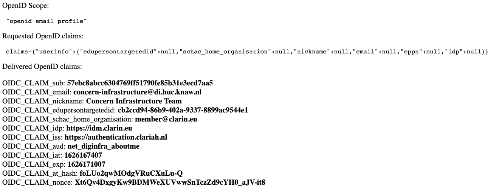

# Authentication

## Summary

CLARIAH provides an OpenID-based authentication service at https://authentication.clariah.nl which can be used to add authentication to your application.

This service is based on [Satosa](https://github.com/IdentityPython/SATOSA). Satosa  is a proxy which sits between applications (service providers or "relying parties") and identity providers (that is, organizations where people can log in). The applications behind authentication.clariah.nl are not known to the identity providers: from the point of view of the identity provider, the application (service provider) which is trying to log in is authentication.clariah.nl. That authentication.clariah.nl is doing that on behalf of another application is of no concern to the identity provider.

By the same token, the various identity providers connnected to authentication.clariah.nl are not directly known to the applications. From the point of view of the application, its identity provider is authentication.clariah.nl. The application does not know that authentication.clariah.nl redirects its authentication request to another (the "real") identity provider, which is chosen by the user by means of the discovery service [discovery.clariah.nl](https://discovery.clariah.nl).

discovery.clariah.nl contains all of the identity providers registered at CLARIN (see "Participating Identity Federations" at CLARINs [Service Provider Federation](https://www.clarin.eu/content/service-provider-federation)). This basically means: all European academic institutions. In addition to this CLARIN-provided collection of identity providers, [Beeld en Geluid](https://www.beeldengeluid.nl/) is also available as an identity provider in discovery.clariah.nl.


## How to register your service at authentication.clariah.nl

To use the OpenID-provider at authentication.clariah.nl, your service needs to be registered. This is a manual process at the moment, handled by the Concern Infrastructure department at HuC-DI.

The OpenID client in your application must have three options configured: `ClientID`, `ClientSecret` and `RedirectURI`. To make this OpenID client known to authentication.clariah.nl, it needs information about it in the following JSON format, in a file called `<ClientID>.json`:

```json
{
  "client_name": "<human-readable string>",
  "client_secret": "<random string>",
  "redirect_uris": [
    "<URL at your application to redirect to after succesful login>"
  ]
}
```

The file should contain at least the `ClientSecret` in the key `client_secret` and the `RedirectURI` in the key `redirect_uris` (an array, as there can be more than one). Depending on the OpenID implementation on the client, more configuration options may be necessary.

HuC-DI Concern Infrastructure can add this JSON file to authentication.clariah.nl and if everything works correctly a federated login flow will be active from then on.

## Login flow (from user point of view)

The first thing the user sees after starting the login flow from a protected application is the discovery service (discovery.clariah.nl), from which the desired identity provider can be chosen: 


From there, the user is redirected to the chosen identity provider and logs in. If the login is successful, Satosa checks if the user has given permission for sharing their attributes with the application. If not, Satosa's consent service shows a screen like the following:


And here the user can cancel everything, at which point the whole login process breaks off, accept the release of all attributes, or make a choice of which attributes to release.
**Note**: it's remarkably easy to sabotage your own login if you turn off attributes which are needed by the application for a succesful login and remarkably difficult to rectify that after the fact. There is no way for the user to edit their choices after clicking "Accept". The choices are saved in an SQLite database, and look like this:
```
675|89ddcbc1dec351e906b3de5d58095a2ad6d2698465b6ed5aa4d006bc14d90a6f93fb5f8acd7c779dfc7cbebf3be0794420caa2a284f91f71b578b42b9940eca5|2021 06 10 07:49:08|12|["eppn", "mail", "schac_home_organisation", "idp"]
```
(id, hashed identifier of request, date/time of saved consent, months valid, which attributes are released)

If the wrong consent has been saved and needs to be removed, the HuC-DI system administrators must remove the offending record from the database, and finding the correct record is not straightforward, since the identifying information has been hashed.

We might have to reconsider if the consent service is actually needed, and if so, perhaps turn off the option to pick and choose from attributes and make it an all-or-nothing choice.

Assuming the release of the attributes was permitted, the user is then redirected to the original application, and the application handles the rest of the login process locally with the attributes it received from Satosa.

We have a test application at aboutme.diginfra.net which does nothing except force a login and show the OpenID information which was received after successfully logging in. After the steps above, it shows:



## Giving users access based on their attributes

If you just configure OpenID authentication based on the OpenID provider at authentication.clariah.nl and leave it at that, be aware that you have now given access to users from around 2300 institutions from all around Europe. That may be a bit much. A more sane approach might be to use authentication.clariah.nl as the first step, and use your own filters on the logged in users: for example, an explicit allow list on the user level (probably a list of email addresses of users who have access), or limit access to all users from particular institutions. In that case, you could filter on the basis of `idp` or `schac_home_organisation`, depending on which of those attributes are available. `idp` should always be available (it is already known before the login process starts), but for the other attributes, authentication.clariah.nl may request them (requested attributes are: `eduPersonTargetedID`,`eduPersonPrincipalName`, `displayName`, `schacHomeOrganization`, `mail`), but it is the decision of the IdP to supply them or not. So, depending on which attributes your application needs, and which attributes an IdP provides, for certain IdP's a successful login may not even be possible.

## Example of an OpenID client: Apache with mod_auth_openidc

`mod_auth_openidc` (https://github.com/zmartzone/mod_auth_openidc) is an Apache module which can be used to protect locations on an Apache webserver, similar to Basic HTTP authentication, but using an OpenID provider for authentication instead of a local `htpasswd` file.
After installing and activating `mod_auth_openidc`, a directory (the root in this case) can be protected using the OpenID provider at authentication.clariah.nl with the following configuration:

```apacheconf
<VirtualHost *:80>
 ServerName ${SERVERNAME}
 DocumentRoot /var/www/html
 
 OIDCProviderMetadataURL https://authentication.clariah.nl/.well-known/openid-configuration
 OIDCSSLValidateServer Off
 # some string which uniquely identifies this client on the OpenID provider
 OIDCClientID the_client_id
 # some random string
 OIDCClientSecret randomstring
 OIDCResponseType "code"
 OIDCScope "openid email profile"
 # this is needed if the client wants to receive non-standard OpenID attributes.
 # in this case edupersontargetedid, schac_home_organisation and eppn, which are requested from the IdPs by authentication.clariah.nl
 OIDCAuthRequestParams claims={"userinfo":{"edupersontargetedid":null,"schac_home_organisation":null,"nickname":null,"email":null,"eppn":null}}
 OIDCRedirectURI https://<hostname>/oauth2/redirect
 OIDCCryptoPassphrase randompassword
 
 <LocationMatch ^/>
 AuthType openid-connect
 Require valid-user
 </LocationMatch>
 
</VirtualHost>
```

The three configuration options `ClientID`, `ClientSecret` and `RedirectURI` need to be present with the same values on both the OpenID client and the OpenID provider.

To make this OpenID client known to authentication.clariah.nl, it needs information about the client in the following JSON format:
```json
{
  "client_name" : "Some human-readable string",
  "client_secret" : "randomstring",
  "redirect_uris" : [
    "https://<hostname>/oauth2/redirect"
  ]
}
```

This small JSON file should be named `<client_id>.json` (so in this example `the_client_id.json`)  and should contain at least the `ClientSecret` in the key `client_secret` and the `RedirectURI` in the key `redirect_uris` (an array, as there can be more than one). Depending on the OpenID implementation on the client, more configuration options may be necessary.
The system administrators at KNAW HuC DI can add this information to authentication.clariah.nl, and if everything works correctly a federated login flow as described above will be active from then on.

It is the responsibility of the client to handle session management and authorization for logged in users, the OpenID provider only handles the authentication.
