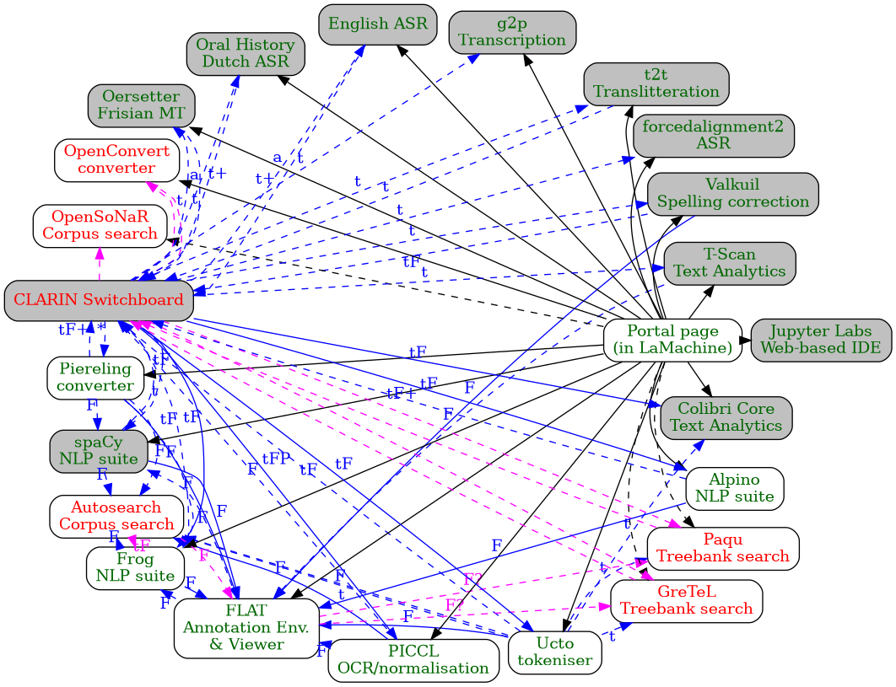

% A discussion on the role of workflows in CLARIAH
% Maarten van Gompel, Daan Broeder
% January 28th, 2021

# A discussion on the role of workflows in CLARIAH

## Introduction

- CLARIAH aims for a common **infrastructure**
- **Interoperability** and **connectivity** between CLARIAH tools
- The workflow interest groups aims to help define these connections
- Connecting tools/services produces a **workflow**

## What is a workflow?

- A sequence of steps towards a particular end
    - a sequence of local tools
        - ``cat input.txt | sed "s/ /\n/g" | sort | uniq -c | sort -rn``
    - a sequence of local tools distributed over a computing cluster
    - a sequence of remote networked components (e.g. **webservices**)
    - some hybrid form of the above
- May involve **parallelisation**
- May involve **orchestration** through a workflow management system: determines which tasks are run when and where
- May be fully **automated** or involve **user interaction**

## Workflow paradigms

- **goal oriented** (GNU Make, luigi, snakemake, Airflow)
    - specify the goal and the initial input and intermediate tasks are resolved automatically
    - Often implemented as directed acyclic graphs consisting of tasks
- **data-flow oriented** (Unix pipes, Nextflow, SciPipe)
    - tasks are defined as a function of how the data flows through
- **procedural** ((shell) scripts)
    - tasks are defined in the order they are performed

(this is not a mutually exclusive division)

## Workflow characteristics

- **Scheduling**: Determining which sequence of tasks leads to the desired end result
- **Execution**: Execution of tasks, possibly with automatic parallelisation/abstraction
    - Abstraction of pipeline logic from execution layer: local execution, computing cluster, cloud platform
- **Monitoring**: Real-time monitoring of a running workflow and ability to inspect logs on failure
- **Correction**: Ability to resume the workflow after failure and manual intervention; and/or automated fallbacks
- **Reproducibility**: Given the same input, the workflow should ideally produce the same output every time
- **Discovery**: automated discovery of possible workflows
- **Interaction**: Human intervention (steering/inspection/visualisation) in at specific points in a workflow
- **Specification**: How are the workflow specified? (languages, abstraction).

(not all need apply)

## Workflow aims

- Offer a more accessible abstraction over a series of complex tasks
    - Offer a series of predefined workflows
- Let users discover tools that can work with their data
    - Let users compose their own workflows
- Offer an execution environment (service) and efficient execution flow

Different audiences may require different workflows.

**Discussion Point #1**: What aims do we prioritise in CLARIAH?

## Interoperability

A prerequisite for a workflow is that the underlying tools or services are in some way **interoperable**.

- **Data exchange formats and vocabulary** - Do the tools use the same data format? Are vocabularies they use (e.g. tag sets
    in linguistic annotation) compatible?
- **Interface specification** - Does the tool/service have a clear interface specification (CLI, API, web API) that is
    well documented and facilitates interoperability?
- **Environment compatibility** - Do the tools run on the same platform (OS/software ecosystem) and architecture? Can the interface of tool B be called from tool A?

**Discussion Point #2**: I advocate a bottom-up focus; setting interoperability requirements at this lower level is a
prerequisite for integrating tools/services in any higher-level workflow. We should focus more on the former than the latter. I think the workflow group could play a role in defining common interfaces, environments and data exchange conventions.

## Workflow solutions used in CLARIN/CLARIAH (1/3)

* *TTNWW* (CLARIN-NL) - A failed project in CLARIN-NL to offer workflows based on Apache Taverna
* [Weblicht](Weblicht https://weblicht.sfs.uni-tuebingen.de/) (CLARIN-D) - An execution environment for automatic annotation of text corpora, integrating various NLP tools. Probably the most populated and well-known environment in the CLARIN domain.
* [Nextflow](https://nextflow.io) - General data-driven pipelines. Used in CLARIAH WP3 by PICCL, Nederlab Enrichment Pipeline.
* [Apache Airflow](https://airflow.apache.org/) - Workflow Management system - A platform to programmatically author, schedule and monitor workflows.
* [Apache Taverna](https://taverna.incubator.apache.org/) - Workflow Management System – a suite of tools used to design and execute scientific workflows and aid in experimentation.
* [Text Tonsorium](https://cst.dk/WMS) (CLARIN-DK) - An NLP workflow management system that automatically combines the necessary
natural language processing tools to achieve your goal.

## Workflow solutions used in CLARIN/CLARIAH (2/3)

* [GATE](https:/gate.ac.uk) (Sheffield University) - Long-time existing NLP software first as locally installed software and now also as a set of services.
* [Galaxy workflow manager](https://galaxyproject.org/learn/advanced-workflow/), used by LAPPS project (US)
* [TextFlows](http://textflows.org) - TextFlows is an open-source online platform for composition, execution, and sharing of interactive text mining and natural language processing workflows. Features a visual programming paradigm.
* [DANS SSHOC DataVerse Cloud](https://www.aclweb.org/anthology/2020.lr4sshoc-1.1.pdf) - Hosting of container based services and workflow creation
* [PARTHENOS platform](https://parthenos.d4science.org) - A hosting platform for building and operating VRE's whereof some offer workflow facilities. The most interesting for CLARIAH is PARTHENOS developed in the PARTHENOS project offering a number of Humanities , CH and NLP (e.g. GATE) services that can be invoked in sequence.
* [ELG platform](https://www.european-language-grid.eu/wp-content/uploads/2020/05/IWLTP2020_Moreno-Schneider.pdf) (European Language Grid project) - A platform allowing for testing (also workflows) of industrial strength NLP services, WU wide consortium, mainly DFKI, CUNI, ATHENA, ...). ELG platform works with containerised services. Container orchestration with Kubernetes.

## Workflow solutions used in CLARIN/CLARIAH (3/3)

**Discussion Point #3**: What other workflow solutions are in use? What do we think about the existing initiatives?

**Discussion Point #4**: What does it mean to develop an infrastructure with respect to workflows? I don't think we
should force any particular workflow management solution, nor set up one centralised platform (and most certainly not develop and add yet another workflow system to the existing jungle)

## Use case: WP3 Virtual Research Environment (1/2)

**Project plan:** Build a kind of virtual research environment without explicitly building a virtual research
environment; it emerges from interconnected parts and an integrated deployment solution.

- **Human mediated ad-hoc workflow:** Add links in the web user interfaces of tools developed in CLARIAH WP3 to allow the user to take the output from tool A to tool B for further processing.
- **Discoverability:** Add the services to the CLARIN switchboard. This suggests tools when the user provides data.
- **Discoverability:** Forge connections in the user interfaces back to CLARIN switchboard
- **Distribution/deployment** via LaMachine

## What connections need to be forged?

**Discussion Point #5**: What tools/services need to be connected? What use cases are there for the connections? This is
not an issue to be solved in the Workflow group but something for an issue for the other groups such as the Text group
and the Audio/Video group.

## Example: WP3 Virtual Research Environment (2/2)

## Proposed specification for simple forwarding of data between webservices

I [propose a simple solution](https://github.com/CLARIAH/IG-Workflows/issues/6) for forwarding data between webservices
in a *heterogeneous* authentication environment:

**Discussion Point #6**: What do you think about the proposed forwarding mechanism? And about the focus on such
interoperability issues in general? Are there other proposals at this stage?

## Discussion

* **Discussion Point #1**: What aims do we prioritise in CLARIAH, with respect to workflows?
* **Discussion Point #2**: I advocate a bottom-up focus; focus on interoperability in the tools first and foremost, and on the
    workflow management side afterwards.
* **Discussion Point #3**: What other workflow solutions are in use? What do we think about the existing initiatives?
* **Discussion Point #4**: What does it mean to develop an infrastructure with respect to workflows? I don't think we
should force any particular workflow management solution, nor set up one centralised platform.
* **Discussion Point #5**: What tools/services need to be connected? What use cases are there for the connections?
* **Discussion Point #6**: What do you think about the proposed forwarding mechanism? And about the focus on such
interoperability issues in general? Are there other proposals at this stage?

