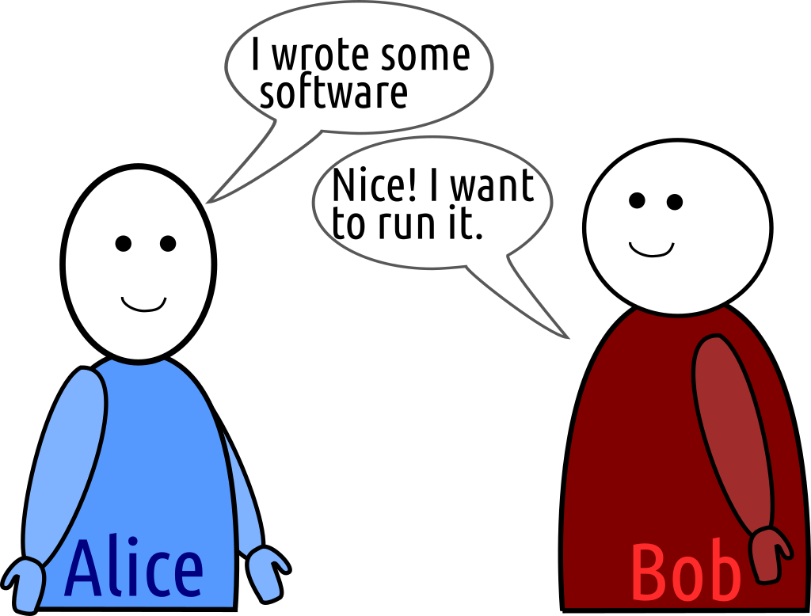
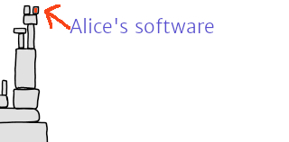
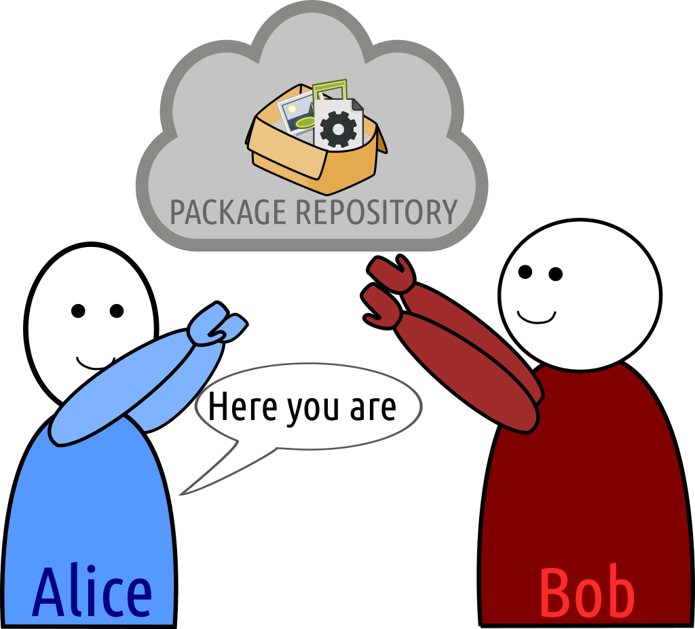
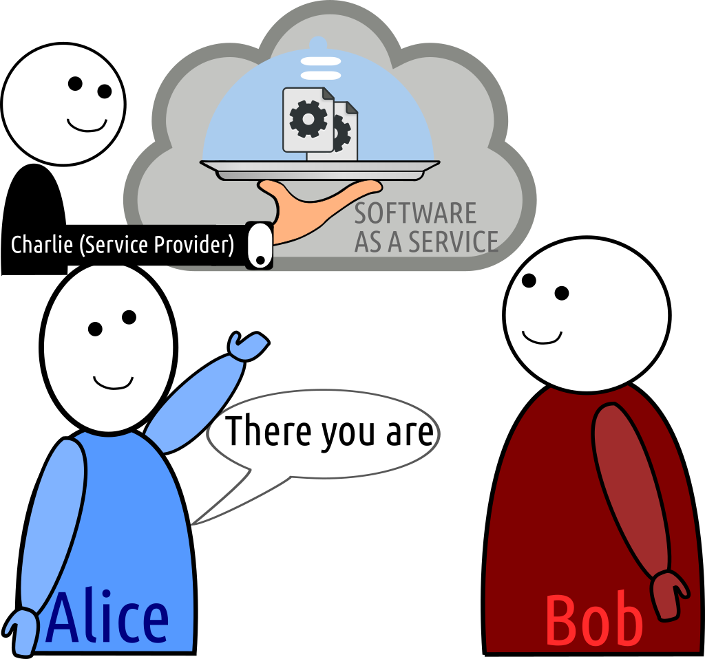

# Alice, Bob, and the problem of distributing software -- a DevOps tale

## The core problem

* *Alice made a software tool*
* *Bob wants to run Alice's software*

* How can Alice make her software available to Bob?
* How can Bob run Alice's software?

[comment]: # Fundamental problem in DevOps; going from Development to IT Operations (continously)

{ height=50% }\

## Solving the problem?

* Alice gives Bob an executable
* Bob runs the executable

{ height=50% }\

## The real problems begin... (1/2)

**Problem solved?**

{ height=40% }\

* Is Alice's executable suited for Bob's OS and architecture?
    * No? Alice must provide multiple executables for different systems
    * No? Bob must use *virtualisation* to emulate another OS/architecture.
    * Not compiled but interpreted? Bob must have the necessary interpreter (e.g. Python, JS, Java)

[comment]: # static linking vs dynamic linking
[comment]: # and these in turn may have dependencies too: welcome to **dependency Hell**

## Back to the origin: Open Source

 * Give Bob the source code and let him build the program himself?
 * Ideally via a source version-controlled repository (e.g. GitHub, GitLab, BitBucket)
 * Requires a higher level of technical expertise from Bob

{ height=50% }\

## The real problems continue: Dependency Hell (2/2)

* Does Alice's program make use of any other software (libraries) Bob also needs?
    * Alice must either provide or make explicit all her dependencies
    * Bob must ensure he has all the necessary dependencies before the program can run
* Alice's program may want to interact with other applications on the system?
    * Bob must ensure they're installed and set up properly
    * Related: Static linking vs Dynamic linking
* Recursive problem, conflicting requirements: **Dependency Hell**

\

## Traditional solution: packaging and distributions

* Distributions host packages for common software in a *package repository*
* Packages in a distribution are carefully tuned to interoperate with one-another (ABI/API compatibility etc)
* A package manager handles packages and all their dependencies  (apt, yum, apk, pacman, brew)
* Alice can now build a package (deb, rpm, apk) and add it to a repository from which Bob can install it.

[comment]: # FAIR avant la lettre..

{ height=50% }\

-------------------------------------

**Problem solved?**

* No, there are many different distributions -> many package repositories
* Maintaining packages takes time and effort (for Alice)
* Packages have to be kept up to date (for both Bob and Alice)

## Language ecosystems

* Language-ecosystems provide their own package repositories:
    * *Python* - Python Package Index - `pip`
    * *NodeJS* - `npm`
    * *Rust* - crates.io - `cargo`
    * *Java* - Maven Central - `maven`
    * *perl* - CPAN
    * *R* - CRAN
    * Ruby - Rubygems - `gem`
* If Alice's software fits into one of the ecosystems well, she should provide a package there

## Software complexity: layers upon layers

**Problem solved?**

* No, Alice's software application may be an integration of an interconnected set of diverse software components:
    * Various languages: doesn't fit a single language ecosystem
    * Various audiences: doesn't fit a single distribution
* Though maybe captured in multiple more traditional packages, **configuring** the integration is often not trivial

{ height=50% }\

## Software-as-a-Service (SaaS)

* Instead of giving Bob the actual program, Alice makes her software available **as a service**.
* Bob can simply access it as a **web application** through his browser (or programatically interact with it as a **web service**)
* Alice now gives her program to Charlie instead of Bob, to **deploy** on a server, Bob accesses Charlie's server.

{ height=50% }\

---------------------------

**Problem solved?**

* The burden shifts from Alice and Bob to Alice and Charlie (who has more technical expertise)
* **Service-as-a-Software Substitute**: having access to a service is a convenience but is **NOT** a substitute for having the actual software.
    * Privacy, data ownership and trust concerns
    * Low-level interoperability hindered: Increased latency, requires network connection
    * Business model vs technical solution
    * Can be a loophole to not provide the source code anymore (GPL vs AGPL)
    * Not suited for everybody

## Virtualisation

* Bob: *"your program doesn't run"*
* Alice: *"But it works on my machine"*
* **Solution:** Alice just gives Bob a copy of her machine and Bob's machine *emulates* Alice's machine: a **virtual machine**

{ height=50% }\

---

* Takes us back to scenario 1, *"Alice gives Bob an executable"*, but in the broadest possible sense of executable.
* Bob now only requires a **hypervisor** to run the VM.
* **Advantages**: Bridges OS differences, isolation from host (security)
* **Problem solved?** No
    * Performance penalty
    * Duplication
    * Resource overhead
    * Isolation from host (integration)

## Containerisation

* Alice again gives Bob a copy of her machine: a **container**.

{ height=50% }\

---

* Share the (Linux) kernel; isolate the rest, no virtualisation needed
* Takes advantage of facilities in the (Linux) kernel
* Significantly reduces resource overhead & performance penalty
* *Caveat:* container engines may resort to virtualisation anyway on non-Linux platforms (e.g. Docker on Windows or
    macOS)

{ height=50% }\

## Container platforms and paradigms (1/3)

**Docker**:

* Application containers, lightweight containers serving ideally single applications
* Non-persistant storage
* Layered images
* Containers are stateless (spun upon anew), all persistant data on externally mounted volumes
* Docker Hub as Container Registry (image store)
* Great for applications containers, deployment of services in cloud infrastructure
* Most known and widely used
* Less suitable for High Performance Clusters (security)

## Container platforms and paradigms (2/3)

**LXC**:

* System containers: acts like a lightweight VM, more traditional environment
* Single-layer image
* File-system neutral
* Persistant storage (typically)
* Fat containers that may serve multiple applications, have a full *init system*.

## Container platforms and paradigms (3/3)

**Singularity**:

* Specifically designed for High Performance Clusters and multi-user environments
* Can use docker images
* No elevated permissions required (security)

## Provisioning a container (or VM)

* *"Alice gives Bob a copy of her machine"*

* Alice builds a (container/VM) image
* using an automated recipe for provisioning (e.g. Dockerfile, shell script, Ansible)
* Alice publishes the container image in a registry
* Bob obtains the container image from the registry

{ height=50% }\

## Container Orchestration

* Alice decided on Software-as-a-Service
* Alice gives Charlie a copy of her machine: a **container**, to offer as a service for Bob and others.

{ height=50% }\

-------------------------

**Problem solved?**

* Alice's service may comprise multiple containers that need to interact.
    * L'histoire se répète?
* Alice's service may be so popular that running it on a single system is not sufficient (scalability)
* What if Alice's program fails and the service goes down?

* **Distributed Computing**: containers can easily be deployed on multiple systems
    * Schedule when a container runs and where it runs (load balancing etc)
    * Spin up multiple containers at once (e.g. docker compose)
    * Spin them up over multiple machines (e.g. docker swarm, kubernetes)
    * Restart a container when it fails (kubernetes)
    * Abstract over the hardware (kubernetes)

## Recap

* Distribution
* Packaging
* Software as a Service
* Deployment
* Virtualisation
* Containerisation
* Container Orchestration

## Recommendations for the CLARIAH infrastructure

No single solutions fits all, be aware of all the different layers and audiencies.

**For all individual software components:**

* Try to make software components minimal components that are reusable
* Publish the source code in **public** Version Controlled Source Repositories (e.g. GitHub)
* Include software metadata with the source code (as codemeta or language-specific)
    * All direct dependencies must be made explicit
* Release software versions periodically when deemed stable
* Package and distribute all the software through proper channels:
    * Language-ecosystem-specific repositories (PyPi, CRAN, Maven etc)
    * or for specific distributions if appropriate

-------------------

**For software services (SaaS)**:

(Offering a service is perfectly valid, and one of the aims of CLARIAH, but is **not** a substitute for offering the actual software
that the user can run himself/herself)!

-----------------------

**For software services (SaaS)**:

* Software services should be delivered to service providers in **containers**:
    * Docker is the most industry-standard solution:
        * Software **developers** should provide a Dockerfile (in public version-controlled source repository)
          allowing anyone to build a container/ multiple containers to deliver the service
        * Application containers (hosting a single application) should be preferred
        * CLARIAH should set up a container registry for use by all participants
        * All service endpoints that a container exposes should be clearly documented
    * When multiple interacting containers are delivered, an initial Compose file or Kubernetes configuration should be provided
      by the software **developers** to orchestrate them.
        * These should be stored in code in version control (may be private).
    * CLARIAH should draft clear infrastructure requirements: the [NDE example](https://github.com/netwerk-digitaal-erfgoed/requirements-infrastructure) is excellent to copy and follow, which is in turn partially based on the [Twelve-Factors](https://12factor.net/).

## References

* NDE Infrastructure requirements: https://github.com/netwerk-digitaal-erfgoed/requirements-infrastructure
* Twelve Factors: https://12factor.net/
* Clipart: openclippart.org (heavily modified by me without any real artistic talent)
* XKCD (comics)
