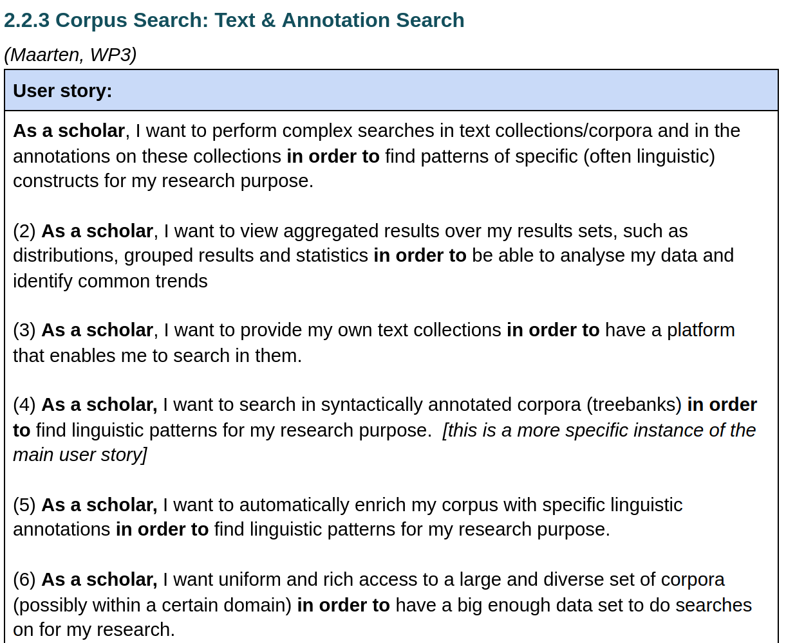
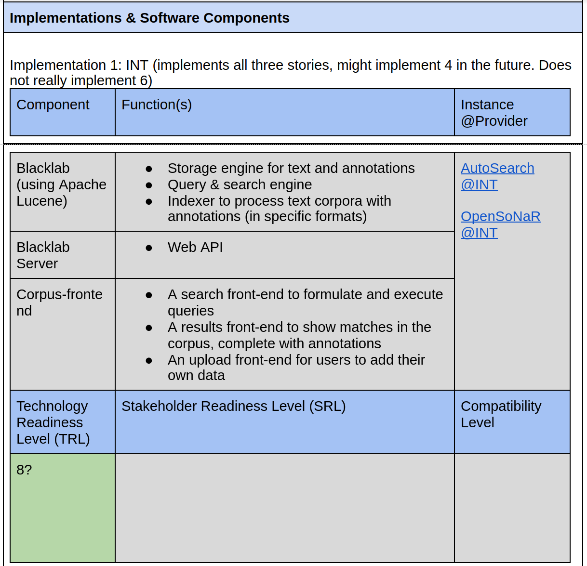
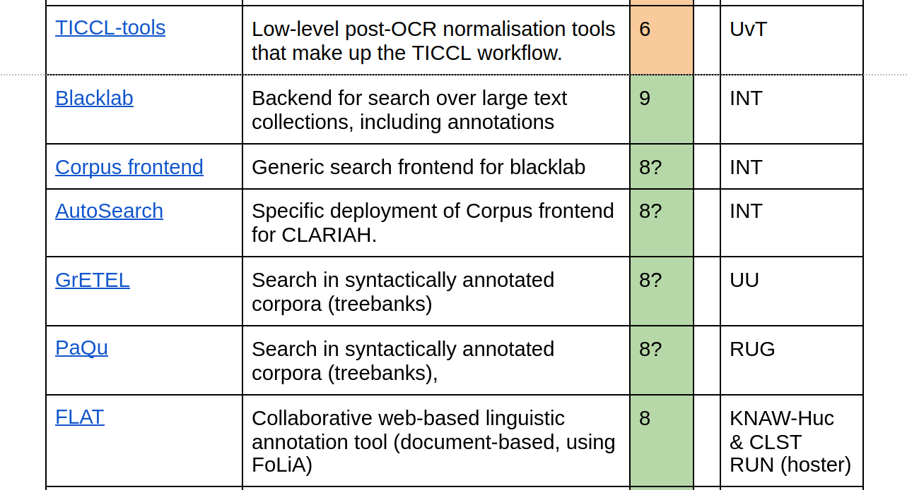
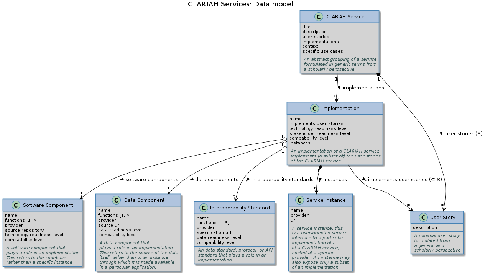

# CLARIAH Shared Development Roadmap: Data Model

## Introduction

The Shared Development roadmap provides:

* A *multi-layered* overview of **CLARIAH services**
* From a generic scholarly perspective to a specific technical perspective

In order to:

* pave to road for CLARIAH-PLUS and possible successor: decide what to postpone
  and what not to do or postpone (**planning**).
* have a complete and transparent **overview**
* promote **interoperability**, cross-WP collaboration and **harmonize** solutions

## Definitions

A **CLARIAH Service**:

* is initially formulated from the perspective of scholarly needs/desires: **user stories**
    * each story is as generic as possible
    * each story is as minimal as possible
    * multiple additional stories may further describe (aspects of) a service
* is not a technical concept but an abstract high-level grouping from a scholarly perspective
* enables a particular *scholarly* workflow and has one or more **implementations**:
    * an implementation consists of one or more software and data **components**, described
      by name and function.
    * an implementation can have multiple **instances**
    * an implementation implements the main user story and *optionally* some of the additional stories
    * can either exist already or be proposed

## Example

* **CLARIAH Service:**
    * **User story:** *"As a scholar, I want to search in a corpus in order to find occurrences of certain words"*
    * **Implementation:** A corpus search platform consisting of software components X, Y, Z
      and data components A, B, C. The components form a certain workflow.
    * **Instance:** A deployed form of the the implementations, hosted at a particular institute and made
      available over the web.

## Template (1/3)

## Template (2/3)

## Template (2/3)

## Data Model

