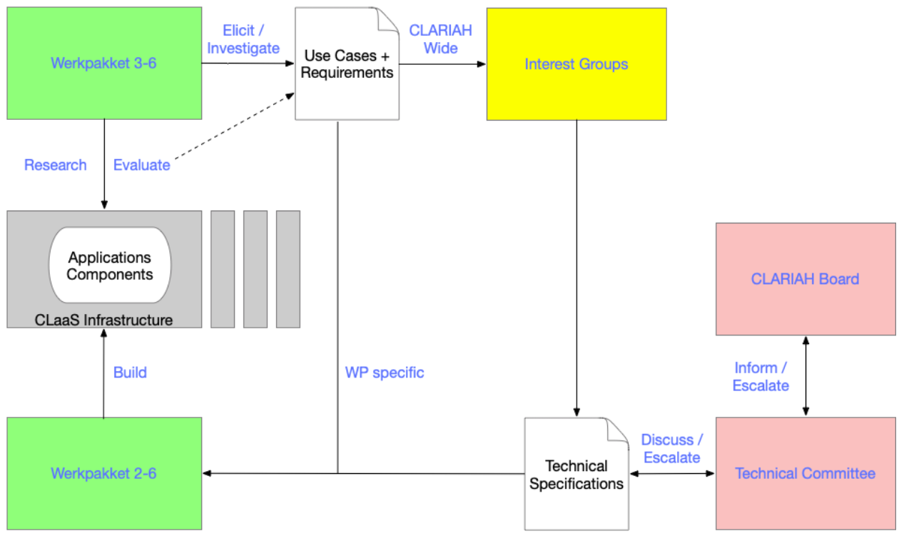

# November 26, 2021

## Agenda
 1. Doel van deze meeting
 2. Aim en scope
 3. Use cases?
 4. Volgende bijeenkomst

## Doel van deze meeting

### Richard:
“het gaat om jullie 'aim', 'scope' en 'use cases'.”
“In principe kunnen jullie denk ik op dit moment alleen een gooi doen naar aim en scope. maar het zou mooi zijn als iemand al een 'use case' kan noemen. degene die ik weet vanuit mijn eigen wp heb ik al neergezet bij github.com/clariah/ig-lod:
Use Cases
[WP4/5] How can I augment my dataset with information from other datasets?
[WP4] Link multiple observations of the same person to each other?
[WP4] How can I analyze Linked Open Data with R / Python Pandas?
[WP4] Computers can now co-write with authors. Can they also assist me to design my hypotheses?
[WP5] How can I discover relevant materials beyond searching for names of the person/film that I'm interested in? (tbc)
3:55
ik weet niet natuurlijk niet of dit binnen scope valt, maar ik weet dat we als 'gebruikers' bij het maken van LOD worstelen met de vraag: en welke vocabulaire moet ik nu gebruiken. We doen nu iets, van 'schema.org' als het kan, awesome humanities vocabulaires als het niet in schema bestaat, en linked open vocabularies voor de rest.”

## Aim en scope

Grote gemene delers:
 1. Advies, best practices
 2. Shared vocabs/data models
    - geo
    - personen
    - gebeurtenissen
    - tijdsperiodes
    - media fragmenten
    - provenantie
 3. Common thesauri, vocabs (termen en/of entiteiten)
    - Wat te doen als je een nieuwe (kandidaat)hebt?
 4. Alignment/matching (reconciliation)
    - Tools
    - (data) scope/lenses
    -tussen data modellen of entiteiten?

Defacto standaard: SKOS?
is iig in de rijksoverheid [al een standaard](https://www.forumstandaardisatie.nl/open-standaarden/skos)

=> uiteindelijk doel: advies hierover voor CLARIAH WPs

### Menzo Windhouwer
- Best practices (good RDF)
- Shared vocabularies (classes, predicates, ...)
- Linking pins (key/authoritative URI providers for objects)
- Matching (exact, close, …)
- Global/Community/Personal alignments

### Willem Melder
- Reuse/Shared data models/ontologies within Clariah?
- Reuse/shared tools for vocabulary alignment. Shared vocabularies within Clariah?
- Goal: exchange of ideas and maybe some convergence?
- Network of terms within Clariah?
- Reconciliation? Against Wikidata?

### Sjors de Valk
- Modelling of dataset descriptions
- Modelling of ‘terms’ (e.g. subjects, persons, places)
- Generic versus specific modelling (e.g. for findability)

### Leon van Wissen
- Linking entities between datasets (e.g. Golden Agents to Clariah-WP4)
- Modelling strategy
  - Event-based vs. property-based
  - Storing textual data as annotations (WebAnnotation) or by pointing to URL)
  - Dates (xsd:date compatible, instead of unparsable 'ca. 19XX')
  - Named graph use
- Preferred vocabularies (e.g. schema, bio, prov, sem, pnv, geo)
- Common thesauri (e.g. AAT, TGN, geonames, HuC/Huygens?)
  - Adding new data, how?
  - Link with Termennetwerk NDE
  - Role of Wikidata?

### Victor de Boer
- Shared data models in Clariah
  - That allow for plurivocality
  - Alignment tools
- Linking within and outside of Clariah
- What needs to be modelled in LD 
  - Data
  - Metadata 
  - Annotations/provenance 
  - Users
  - Data scopes
  - ..

### Enno Meijers:
Advise / share best practice about :
- shared datamodels and vocabulairies
- alignment strategies and tools
- linking to other networks and infrastructures

Mari Wigham
- Alignment tools, strategies and experiences
- Shared thesauri/vocabs and mappings to these
- Experiences in solving mapping issues
- How best to use mappings - transform data, use inferencing to query via mapping, …?   (especially if maintaining multiple mappings for different target groups)
- Store provenance of alignments (also versioning, updates)

## Use cases?

- Use case: alignment met wikidata (WP5)

  - Goal: align persons in the GTAA thesaurus with persons in Wikidata, to help Media Suite users to disambiguate persons while searching, and to get additional information about persons in the Sound and Vision archive. Later this will also be used to support advanced querying and analysis, such as finding programmes with female presenters, or analysing the age distribution of chat show guests.
  - Method: Alignment via SpinqueDesk, with manual confirmation via Mix-n-match
Selected fields from wikidata imported to our own linked data store via the wikidata API
Mapping GTAA and wikidata properties to schema.org
Grlc to make the information available to the Media Suite front end
  - Issues faced:
Performance when using separate linked data stores
How to model person data from separate sources so that:
Can query over all sources and get one set of results
Can choose to query a specific source, or can see the source of a particular result 
Wikidata API limits when using grlc
Performance of triple store, and overhead in API calls
Manual approval takes a long time (currently 27% of person alignments approved)
Handling incomplete data
- Use case: link tussen facsimile en NE (GA, CL?)

## Volgende bijeenkomst
Over 3 weken
### Acties
1. Inventariseer use cases voor who, what where bij jullie achterban
2. Kloppen de grote gemene delers?
3. Wat heeft prioriteit voor CLARIAH?
4. NER in scope?
