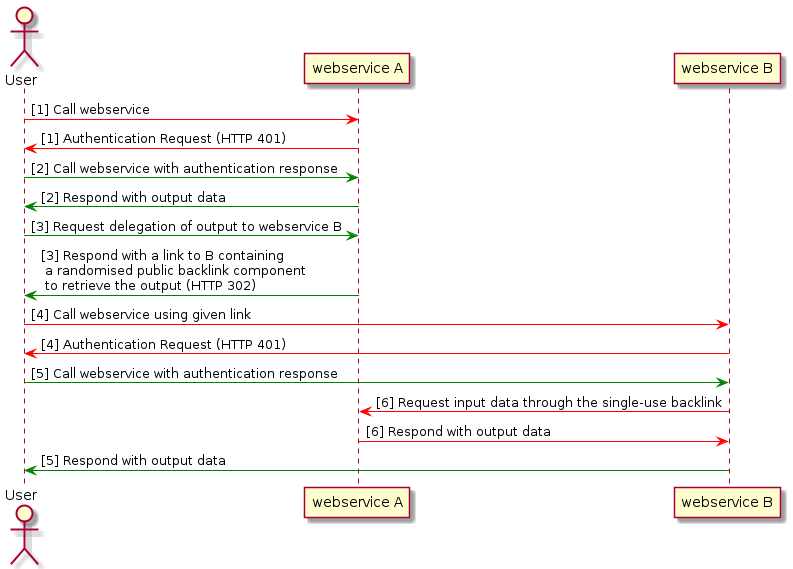

# Forwarding mechanism for webservices in a workflow

*(Maarten van Gompel, 2021-01)*

## Introduction

This is a proposal for a method to forward the output of one RESTful webservice to another, on behalf of a user in a
heterogenous authentication landscape. Effectively, it enables a workflow where the output of one service is the input
of another. The aim is to have a simple solution that does not rely on any additional infrastructure and not does
require full-fledged user delegation.

The use case is as follows: a user wants to forward certain output from
webservice A to webservice B, for example to be used as input for further
processing. This would seem trivial enough, either webservice A pushes its
output webservice B (HTTP POST/PUT), or webservice B pulls the output from
webservice A (HTTP GET).

The situation becomes more challenging, however, when both webservices are
behind an authentication wall, as is often the case. This limits direct
communication between A and B as additional input from the user is required. An
obvious possibility is to let the transfer be mediated by the user himself, but
this would either require additional actions on the user's part, especially in
the case where the user is a human end user addressing a web frontend, or
require additional client-side software components at the user's side.

Though CLARIAH aims for a federated single-sign on authentication
infrastucture, this is not always in place, and such solutions may
not always suitable for access by automated agents as it
requires user intervention (login).

## Proposed Solution

To circumvent these problems and have a solution that works in environments
with heterogenous authentication environments, I propose webservice A makes its
output available, upon explicit request by the user, using a one-time download link that
requires no further authentication. This download link should contain a sizable
random component, some random ID, so that it can not be guessed by an attacker,
and it should only be transmitted over an encrypted connection (HTTPS).

The user can then access webservice B and pass along the backlink to this
one-time download link from webservice A. Webservice B then calls webservice A,
without any further authentication, but encrypted using HTTPS to obtain the
output from webservice A. After this request and webservice A's response,
webservice A invalidates the backlink that was used.

The full procedure is visualized in Figure 1.

The red arrows indicate unauthenticated communications, the green ones
authenticated ones. All communication, both red and green, is always assumed to
be encrypted over HTTPS, as otherwise the output data would be compromised.

An alternative form for step 3 would be to simply request only the backlink
from webservice A, rather than the backlink wrapped in a call to webservice B.
The distinction is where you want to place the burden of correctly calling
webservice B, the user or webservice A. In the way the schema is layed out now,
the transition from 3 to 4 is immediate and requires no user intervention.

### File transfer

I have used the generic term *output data*, but I want to narrow it down a bit
more and define output data as a single file, of whatever kind. This means that
the response in both steps 2 and 6 carry a certain mime type and possibly
specify a filename using the Content-Disposition HTTP header.

The current proposal does not cover multiple files, but a multi-file scenario
can be simplified to a single-file one if files can be packed in an archive
(e.g. zip or a tarball). This does place an extra demands on the receiving webservice,
as it has do do extraction and validation.

### Push vs pull

I proposed a pull mechanism where webservice B initiates the request to obtain
data from webservice A, rather than a mechanism in which webservice A initiates
the request and pushes the data to B. This is preceeded by a pull request from
A to B. I think a push scenario would add some
additional complexity compared to the pull scenario.

### Recommendation

In the context of CLARIN/CLARIAH, this simple forwarding mechanism is already
implemented by the [CLARIN Switchboard](https://switchboard.clarin.eu/) and
[CLAM v3.1](https://proycon.github.io/clam), both tools can play the role of
either webservice A or webservice B. The implementation in CLAM is developed
in the scope of the [CLARIAH WP3 Virtual Research Environment
plan](https://github.com/LanguageMachines/clariah-plus-tasks/blob/master/di.huc/vre-plan3/plan.pdf).

My recommendation is to implement this more broadly. The burden for this is
mostly on the webservice whose output is to be delegated (A). It requires the
implementation of an unauthenticated endpoint (with a random component) where
certain files can be obtained, and a mechanism for users the request their
output to be shared in that fashion and obtain the link with the random
component.

On the part of the receiving webservice (B), it requires merely the
implementation of the ability to download (HTTP GET request) its input from an
arbitrary URL, possibly taking into account metadata such as mime type and
filename.

