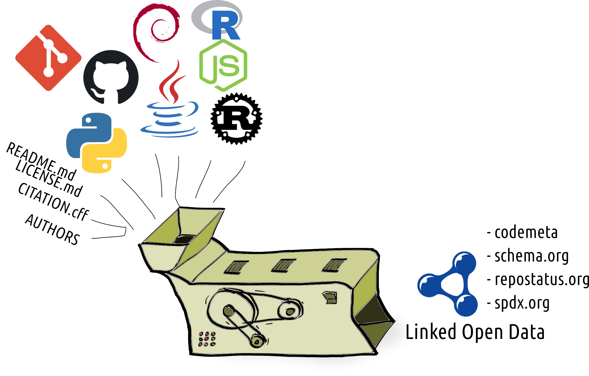
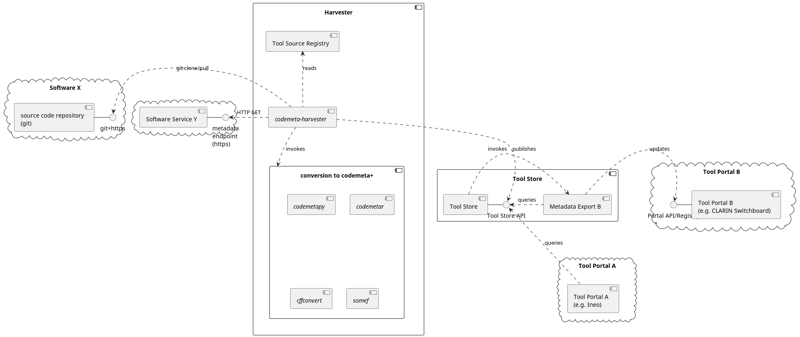

## Introduction

We want to *automatically* harvest, convert and make available **software metadata** and **software service metadata**.
We develop such a *data provisioning* pipeline so it can in turn be used by portals (e.g. Ineo) which end-users (researchers) use to  can search and explore suitable tools for their needs.

## Guiding Principles

* **Do Not Repeat Yourself**; reuse existing software metadata practices and existing standards
* **Metadata at the source**
    * developers themselves are best suited to describe their tool
    * all software derives from sort of source code
    * bottom-up, provenance
* **Short automatic update cycle**; ensure information is always up-to-date
* **Validate**; ensure information is correct and warn if it isn't
* **Linked Open Data**; highly structured and interconnected data
* Distinguish **Software** and **Software as a Service**

## Harvester and Converter

Implemented in [codemeta-harvester](https://github.com/proycon/codemeta-harvester) and the underlying
[codemetapy](https://github.com/proycon/codemetapy) tool.

## Software Components

## Tool Store

* Simple in-memory triple store
* Offers JSON-LD and Turtle serialisation for every resource
* SPARQL endpoint (plus YASGUI interface for interactive use)
* Simple web-interface for end-users; gain some insight into the data

Implemented in [codemeta-server](https://github.com/proycon/codemeta-server)

## Towards prescriptive metadata

Automatic harvesting is not always enough:

* Non-standardized input
* Errors
* Additional prescriptive domain-specific vocabulary demanded by the project (e.g. CLARIAH)

Tool developers can use the [codemeta-harvester](https://github.com/proycon/codemeta-harvester] to
generate a `codemeta.json` for their software, then edit/amend it and add it to their source code repository.

## Demo

https://tools.clariah.dev.nl

