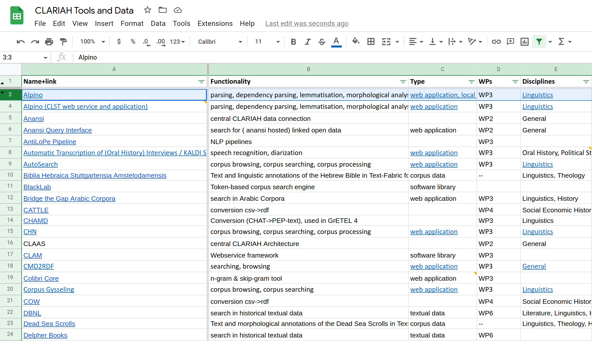
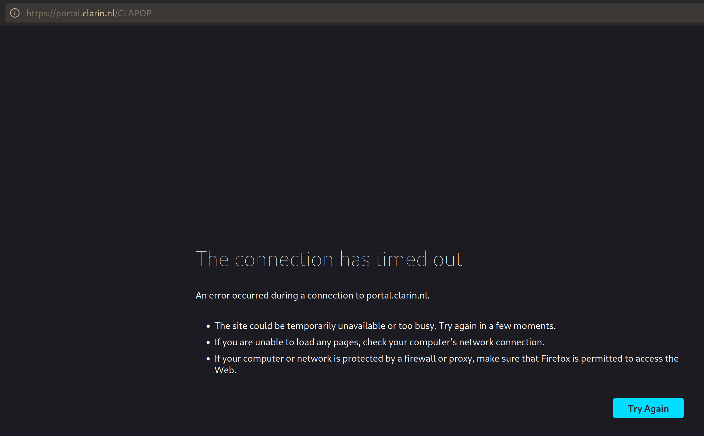
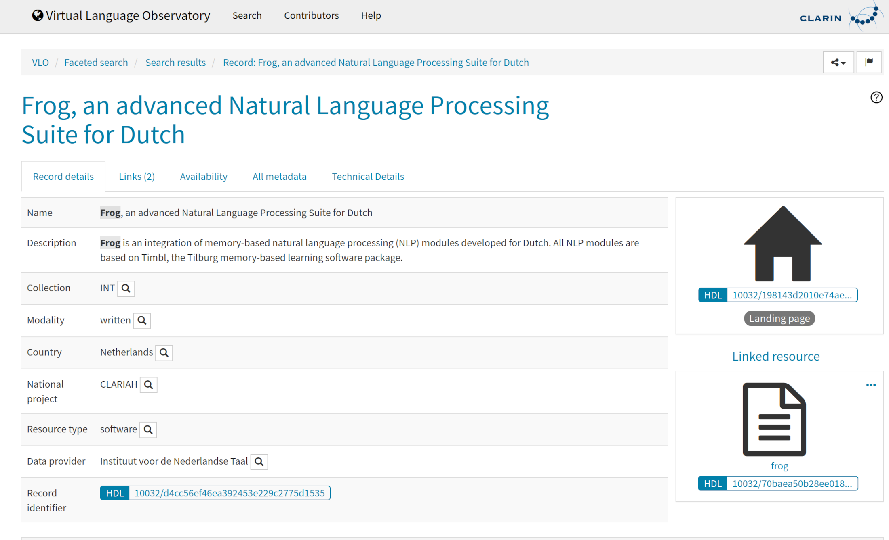
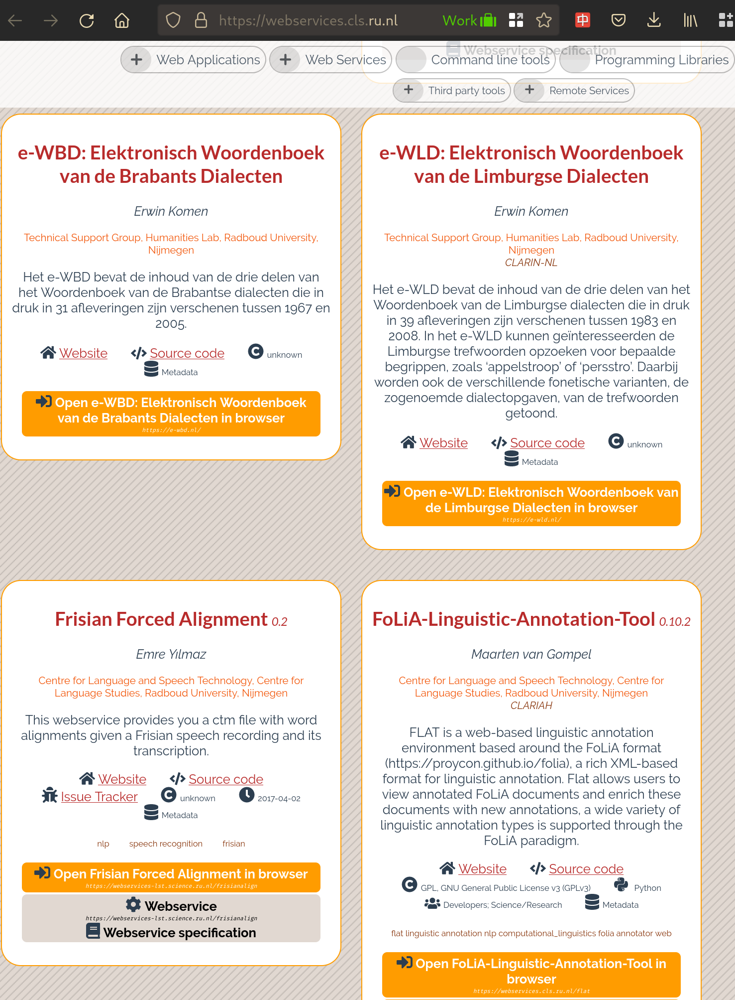
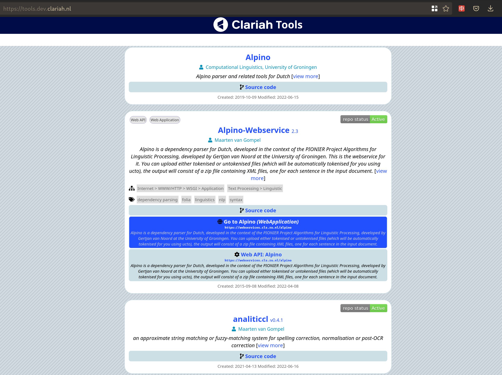
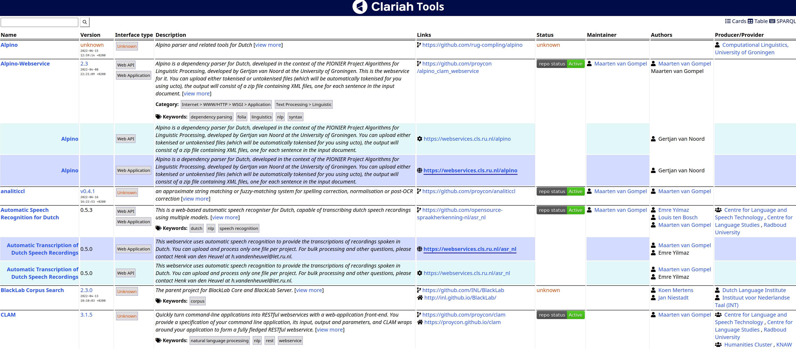
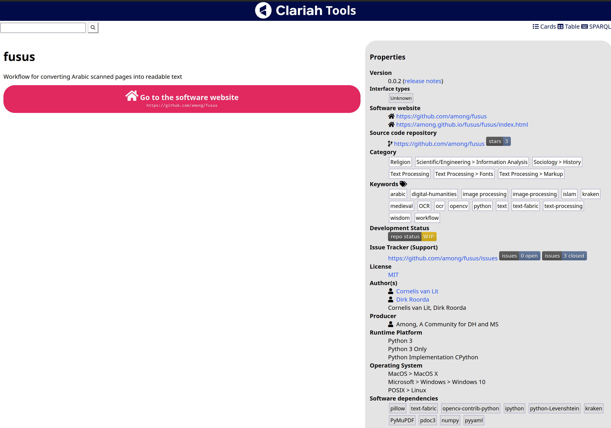

## Introduction

**How do we help scholars find the tools they need?**

## Challenges

Scholars face various challenges:

1. How to learn what tools CLARIAH has to offer? -- How to get an *up to date* and *complete* overview of all tools produced in CLARIAH?
    * Projects like CLARIAH and predecessors (CLARIN-NL) produce a large amount of software tools
    * Which tools are even considered CLARIAH tools? How much legacy from the past do we want to carry along?
    * Existing portals are often *incomplete* and *out of date* (e.g. CLAPOP), too reliant on manual curation
    * Existing portals cover only a single institute or a subset of CLARIAH tools

## How **NOT** to get a sensible overview of all tools produced in CLARIAH?

Manually compiled lists, shared ad-hoc, are not sustainable:

## Existing portals are often *incomplete* and *out of date*

**Why?**: they rely on manual curation by a content maintainer

... or they are simply down altogether:

## Existing portals are often *incomplete* and *out of date*

**Why?**: they harvest old information from other portals. Unnecessary middle-men

## Existing portals only cover a single institute or a subset of tools

## Challenges (2)

Scholars face various challenges:

1. How to get an **up-to-date** and **complete** overview of all tools produced in CLARIAH?
2. How to **identify** which tools are suitable for their needs?
    * Relies on availability of *accurate* and *complete* metadata
    * Software offers various interfaces, suited for specific audiences *(e.g CLI, Web application, web service, python module)*
    * Software may be too experimental
    * Software may be unmaintained/outdated

## How to identify which tools are suitable for their needs?

Scholars will get frustrated when:

* Software doesn't install
* Software is buggy
* Software doesn't offer an appropriate interface
* Software doesn't make clear what problems it solves
* He/she has no idea how to use the software (lack of documentation?)
* There's nobody who can answer support questions, fix bugs (software not maintained?)

## Out Mission

*Our mission:* We want to provide accurate **software metadata** so the user doesn't fall prey to these frustrations

## Our solution (1)

1. How to get an **up-to-date** and **complete** overview of all tools produced in CLARIAH?
    * Developers know best how to describe their software *alongside their source code*; full agency; no man-in-the-middle
    * Periodic and automatic harvesting of software metadata *from the source*
    * Accommodate *existing* software metadata practises, map them to a *uniform vocabulary*.
    * Strong requirements to CLARIAH participants to include all their software to guarantee *completeness*

## Our solution (2)

2. How to **identify** which tools are suitable for a scholar's needs?
    * To make this decision, metadata must be accurately reflect various aspects of the software, including:
        * Name, description, authors, maintainers & contributors
        * Support channels *(e.g. bug/issue tracker, mailing list)*
        * Licensing and access
        * The interface types *(command line? library? web app? mobile app?)*
        * Target platform *(Linux, Windows, macOS, web, mobile, python..)*
        * The development status *(actively maintained? abandoned?)*
        * Technology readiness level *(proof of concept? experimental? proven?)*
        * Links to documentation, release notes, screenshots
        * Associate publications
    * We provide a uniform way of describing this metadata as Linked Open Data (and require this from developers)
    * User must be given the ability to search on arbitrary metadata (e.g. faceted search)
    * Software must comply to certain software requirements ensuring a certain quality. We can automatically test compliance (to a limited degree) and communicate to the user whether these are met.

## Deliverables

We deliver the following:

1. A **metadata harvesting pipeline**; software for harvesting and conversion from heterogeneous software metadata sources
    * **Tool Source Repository**; input for the harvesting pipeline, aimed at developers
2. A **Tool Store** that makes available (and searchable) all harvested metadata
    * Web interface for end-users (limited)
3. **Software Metadata Requirements**; document requirements and specifies the necessary *vocabulary*, aimed at developers

## Tool Store: Example (1)

## Tool Store: Example (2)

## Tool Store: Example (3)

## Objectives

Our objectives from a more technical perspective:

1. Ensure software providers need to specify their metadata *only once* and can reuse *their* existing sources as much as possible
    * Ensure software providers need to register their software for inclusion in  CLARIAH only once (Tool Source Repository)
2. Establish a single well-documented unified vocabulary for our software metadata needs; automatically convert to that
    * Fully embrace Linked Open Data as a standard
    * Build upon existing initiatives
3. Short automatic update cycles (harvesting at regular intervals)
4. Provide an API and/or export abilities for integration with other tools (e.g. Ineo)

## Technologies

* **Linked Open Data**; all harvested software metadata is made available as Linked Open Data 
    * we use JSON-LD and Turtle for serialisation, we provide SPARQL endpoints for querying
* **schema.org** and **codemeta**; we build upon these main vocabularies
    * Conversion from heterogeneous existing metadata formats for software: ``setup.py`` (Python), ``pyproject.toml`` (Python), ``package.json`` (js), ``pom.xml`` (Java/Maven), ``Cargo.toml`` (rust)
* **repostatus.org**, **spdx.org**; additional vocabularies we use for certain terms
* Where necessary we propose new vocabularies in collaboration with the wider community

## Technologies: Harvester and Converter

## Technologies: Full pipeline

## Collaboration

* Relation with **Codemeta**, **schema.org**:
    * We use their vocabularies and build extensions where needed, which we contribute back
    * Seeking embedding within the wider community
* Relation with **Ineo**
    * We provide the data feeding Ineo *automatically* and *regularly*
    * Ineo will act as front-end for a (subset) of our data
* Relation with the *Research Software Directory* (eScience):
    * Initial talks on establishing common representations and making our tools interoperable
    * The RSD might provide a user-friendly way for authoring software metadata manually but with smart automatic assistance
* Relation with CLARIN:
    * Output from earlier projects is considered in vocabulary-choices
    * Export towards CLARIN's infrastructure (CMDI and CLARIN switchboard) is on the agenda

