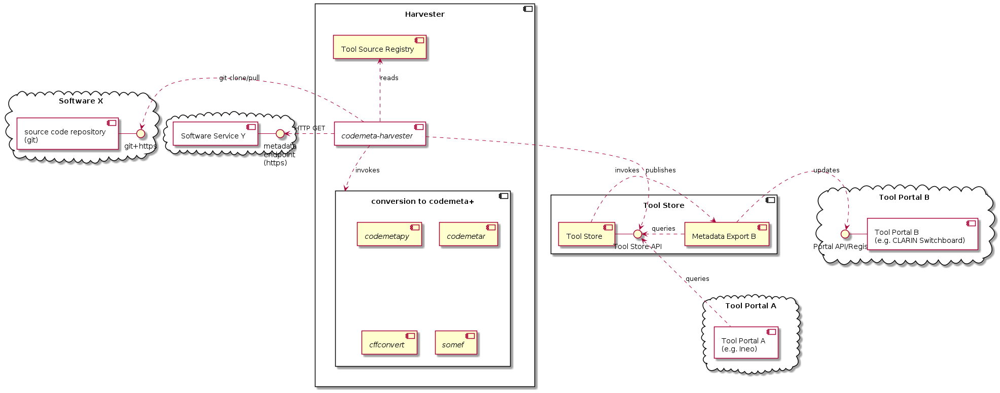

## Introduction: User Story

1. **As a scholar, I** am looking for tools and want to browse through and search in a registry of available tools **in order to** select the tools I need to further my research.
    * The registry should offer sufficient information for me to make an informed decision on suitable tools to explore.

**Ineo?**

## Introduction: Tool discovery

* **As an infrastructure provider, I** want all tool metadata to be automatically harvested from the source **in order to** ensure the data is always up to date and facilitate maintenance.
* **As an infrastructure provider, I** want to be interoperable with the wider CLARIN infrastructure **in order to** have tools available in other CLARIN portals.

* **Our aim:** Provide a common harvesting pipeline and a common metadata store to open for all front-end systems (e.g. for Ineo, CLARIN switchboard)

## Metadata with the source

* Developers themselves are best suited to describe their tool
* Metadata should be stored alongside the source code
    * i.e. in the source code repository under version control
    * This already happens to a certain degree
        * different ecosystems, different vocabularies
        * reuse these existing metadata specifications

## Metadata Vocabulary

* Linked Open Data
* Codemeta and schema.org
    * https://codemeta.github.io
    * https://schema.org
* Maps existing metadata schemas (crosswalks)
    * Python Distutils, DOAP, Java Maven, Debian, Citation.cff, etc etc
* Automatic conversion from existing metadata schemes in the sofware world

## Objectives

* Ensure served metadata is up-to-date and accurate
* Prevent metadata duplication whereever possible
* Automate as much as possible
* Automatic controls/validation on metadata
* Limited effort for developers
* No effort for portal content managers (e.g. Ineo)

## Challenges

* Too Open vocabularies
    * But agreement on tighter restrictions for CLARIAH may be needed
* Extra domain-specific vocabulary
* Slow moving projects
    * Extensions on codemeta/schema.org
    * Main proposal: https://github.com/codemeta/codemeta/issues/271
* Getting partners to comply to necessary metadata requirements

## Software Components

## Guiding Principles

* Do Not Repeat Yourself
* Re-use existing software
* New software should be as minimal and simple as possible

## Technologies

* metadata specification: codemeta/schema.org
    * Linked Open Data
    * serialisation: JSON-LD
* codemeta-harvester: POSIX shell
* tool source registry: yaml config files in a git repo
* codemetapy: Python
* software source repositories: git

## Tasks & deliverables

(See project kanban board: https://github.com/orgs/CLARIAH/projects/1/views/1 )

32. Define extra vocabulary for tool discovery
33. Implement Harvester Component
34. Implement Tool Store Component
35. Ineo export
36. CLARIN Switchboard export
37. CMDI export
40. Formulate software metadata requirements

## Team

**Development:**

* Maarten van Gompel (KNAW HuC), developer & coordinator

**Stakeholders**

* Menzo Windhouwer (KNAW HuC), IG Vocabularies and FAIR Datasets
* Jan Odijk (UU), CLARIN/CMDI compatibility, MD4T task WP3
* Roeland Ordelman (B&G), CTO

**Vacancies:**

* We could use an linked data expert! (WP4?)
* Liason from Ineo
