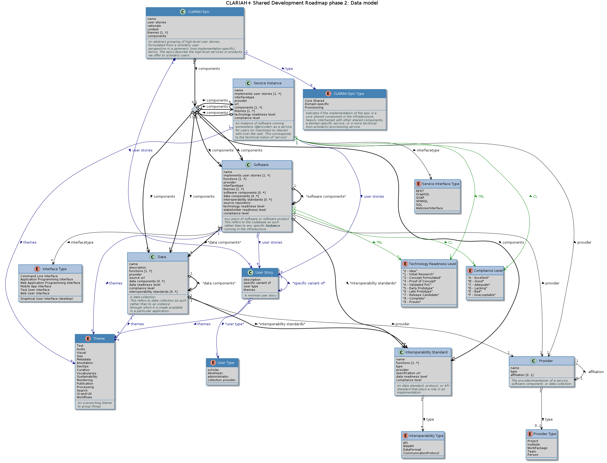

# Introduction

To streamline the development of the CLARIAH infrastructure across work
packages, a CLARIAH Shared Development Roadmap (SDR) is created. This SDR
specifies what high-level epics CLARIAH will implement and deliver in its the
infrastructure. These can subsequently serve as a showcase for the success of
CLARIAH.

## Prior work

In phase 1 we identified and described all components and services that are
existing or have been worked on in CLARIAH-CORE/PLUS. We called those "CLARIAH+
services" but there was some confusion about the term, we are moving to the
term "CLARIAH+ epic" now.

## Goals

In this phase 2 we will put the emphasis on formulating high-level epics and
the underlying services, sofware and data components that implement these
epics.

The goals for phase 2 are:

* Establish which are the *core shared* CLARIAH+ epics. Emphasis for the shared
 development roadmap is on these core shared stories, i.e. we are trying to steer the focus for the remainder of
 CLARIAH+ to development of core infrastructural components.
* Define for each:
    1. What it entails; what are the user stories that make up the epic? Are we all on board with the plan?
    2. Which software/service/data components are needed and what interoperability standards will be adhered to?
    3. How do the components fit together to make a whole? How do the core components relate to other components? By
       definition, the core shared components should be heavily inter-related. The use of diagrams is strongly encouraged here.
    4. Where can service instance(s) be hosted?
    5. What people need/want to be involved?
    6. Come up with a resource planning that can serve as input for the revised 2022-2023 workplan. For each
       epic we have a dedicated GitHub projects kanban board and list that should be used for planning and during
       development (this offers transparency and facilitates cross-institutional collaboration).
    7. Come up with arguments for additional investments from CLARIAH in the services if needed
* A similar procedure applies to the domain-specific services, though the details of these may often be confined to a
  particular WP. We do need broad agreement which domain-specific services we consider worth the effort and which to drop.

The overall objectives of the Shared Development Roadmap are:

* Identify and foster cross-WP and cross-institutional collaboration opportunities (CLARIAH services spanning components from multiple WPs)
* Fill 'gaps' needed to provide an actual common shared infrastructure.
* Get an accurate overview of how CLARIAH epics relate to everything that has been developed in CLARIAH.
* We seek to harmonize various solutions developed within CLARIAH; determine which are mature and have potential, which can be discarded, which to go forward with in a potential successor project.
* Foster interoperability between software/data components

## Definitions

### CLARIAH Epic

A **CLARIAH Epic** is describes the needs of a scholar in broad and generic themes. The epic is made up of multiple user
stories, which are mostly described from a scholarly perspective. The epic effectively formulates a 'CLARIAH
service' in the largest sense of the word; a product/functionality offered by CLARIAH to scholars.

The implementation(s) of an epic facilitate a certain *scholarly workflow*; a scholarly workflow is defined as a
sequence of steps (e.g. analysis, data transformation, presentation) that serves specific needs of a scholar.

We distinguish three types of CLARIAH epics:

1. **Shared core epics** - The epics describe stories that provide core shared functionality for the infrastructure as a
   whole. These services that implement these serve scholarly use cases and are generic or pervasive (i.e. the needs or requirements that need to be fulfilled are often not directly formulated and recognized as such by scholars). These provide an important pillar for the shared infrastructure. Their development is typically a cross-WP effort.
2. **Domain-specific epics** -- These epics describe stories that cover important functionality for scholars, but are not considered central to the shared infrastructure. The resulting services may be of a more domain-specific nature.
3. **Provisioning epics** -- These are the exception to the rule in the sense that they are not scholarly stories, but are important facilitating stories for the core infrastructure. Their implementations provide low-level pervasive functionality required by most other services (such as authentication, deployment).

A CLARIAH epic is formulated from the perspective of where we want to go with CLARIAH and its common infrastructure,
rather than from the perspective of what is the current status-quo.

A CLARIAH epic is realized by one or more components that implement it. These components can be service instances,
software components and/or data components and/or interoperability standards that enables a certain workflow.

We aim for “minimal viable” epics and services, this means that we also aim for a minimal viable set of components that makes up a service

*Note:* Our use of epic corresponds largely with a (highest-level) epic in 'agile' terminology (although some might call this a theme).
However, underlying user stories may themselves be considered epics. At this stage we are not concerned with what can be accomplished in single 'sprints'.

### Software

**Software** is any computer program and refers to the codebase as such. We make an explicit distinction between the
software and software offered as a service, a **service instance**. Software can be described on any level, it may
itself consists of *software components* (i.e. dependencies), *data components* (data required to run the software), and
adhere to certain *interoperability standards*. Software has a *provider*, which is the institute/person that maintains
and/or develops it.

Software is described in terms of the function(s) that it implements.

### Service Instance

This is an instance of **software** when running as a *service* in the CLARIAH infrastructure, offered over the web
using a particular *interface*. We use this term to refer to a specific service instance, hosted by a specific
*provider*. The provider of an instance need not be the same as the provider of the underlying software. Services
consist of underlying software/data components. A software component is mandatory.

### Data

**Data** is any kind of data collection, usually in a specific form and fit for a particular purpose.
Data should best be considered immutable, any processing done on it forms a new (derived) dataset. Data
can therefore itself consist of *data components* to describe that it is builds upon other data in some way.

Data can also be linked to interoperability standards, such as data formats.

### Interoperability Standard

An **Interoperability Standard** is any agreement/protocol/data model/data format designed to facilitate
interoperability between multiple software components.

## Evaluation

The status of all service/software/data components and the CLARIAH services as a whole are assessed on three axes: a
user axis, a technology axis, and compliance axis:

For the user axis we use the [Stakeholder Readiness Level (SRL)](stakeholder-readiness-level.md) a measure that defines the user readiness of a new service to be used by scholars.
The technology axis we define using the [Technology Readiness Level (TRL)](technology-readiness-level.md), a measure that defines the development status of a service.

Compliance with the [CLARIAH Software requirements](), the [CLARIAH Infrastructure requirements](), the [Documentation
Standard](), and possible other future requirement specifications. The compliance levels themselves are defined
[here](compliance-level.md).  It is suggested that SRL level should be estimated by a user panel. Ideally the other
levels should also be independently estimated, but in this phase a self-assessment is more realistic.

## Data model

The following schematic (UML) illustrates the data model we use for describing CLARIAH services. Classes with dark blue
headers are described primarily from a user perspective, these are connected with blue arrow, classes with light blue headers denote more technical
terms. Green arrows are used for evaluation relations.

