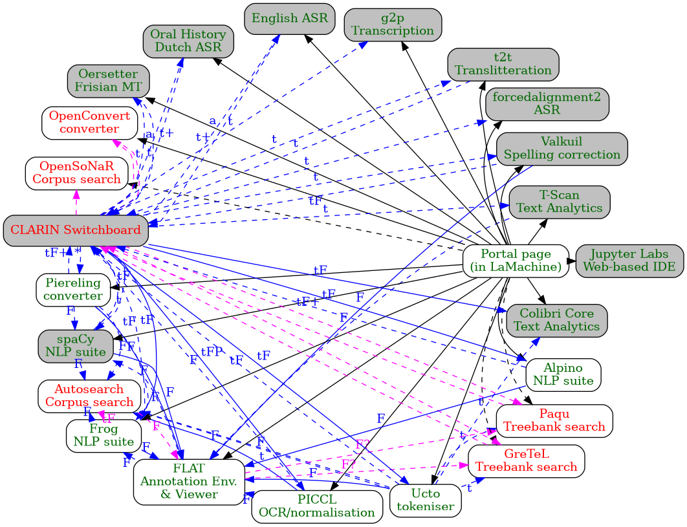

# WP3 Virtual Research Environment Plan 3

```
Maarten van Gompel
DI, KNAW Humanities Cluster

Revision 1.2.1 - 2020-11-20
```

## Introduction

The term Virtual Research Environment (VRE) is usually surrounded by
significant vagueness. I would like to broadly yet minimally define a Virtual Research
Environment (VRE) as, in its core, a software infrastructure in which a
researcher has multiple inter-connected software tools at his or her disposal
that aid in his/her research.

In this regard, a VRE addresses fragmentation of tools and services and
connects different tools/services in a way that helps the researcher accomplish
his goals.

This plan is a third attempt to deliver on some (but certainly not all) of the
ideas for a WP3 VRE, in the light of the significant funding that was awarded
to this project, and that builds on the progressive insights producted by the earlier attempts.

### History

Plans for a WP3 Virtual Research environment already emerged in 2017 during
CLARIAH-CORE. A first plan was formulated by Daan Broeder, Menzo
Windhouwer and Matthijs Brouwer. They state their aim as follows:

*"The CLARIAH WP3 VRE should offer an environment that integrates many of the
the tools and services that were and are developed and supported in the
CLARIN NL and CLARIAH (WP3) projects."*

In their vision for Virtual Research Environment (VRE) for WP3, they propose
development of an infrastructure for data management or resource administration (with special
attention to provenance data, archiving of results, personalised user spaces),
container/service deployment, workflow orchestration and even user interface
adaptation.

At the time, I provided a [technical feedback
report](https://download.anaproy.nl/vre_feedback.pdf) to these plans, pointing
out some concerns I had, mostly regarding the highly ambitious nature and
doubts whether it would be practically feasible. I also mentioned at the time, that a
comparable effort was undertaken before and had failed, the TTNWW project, and
that it was important to draw lessons from that.

Alongside the initial VRE endeavours, I wrote a [plan for LaMachine
v2](https://github.com/proycon/LaMachine/blob/master/lamachine_v2_plan.md) and its connection to the VRE. This current
plan for the VRE can be considered a logical continuation of that earlier plan and in fact reiterates a lot of what was
said back then.

Not withstanding the efforts of the participating
developers, the [first VRE
attempt](https://github.com/meertensinstituut/clariah-wp3-vre) was halted in
mid 2019. The complexity of the original plan, as well as the lack of
actual users that would adopt such a VRE, may have played a role here.

In [a second VRE
attempt](https://github.com/knaw-huc/clariah-wp3-vre-workflows), the plan was
drastically stripped and reduced to one of its core components; the development of
workflow recipes that interconnect WP3 tools. These were implemented in simple
shell/python scripts that sequentially invoke a number of software components. Some
possible use cases for potential workflows were initially proposed in general
terms by Jan Odijk, upon which I expanded by by [specifying some specific
workflows](https://github.com/knaw-huc/clariah-wp3-vre-workflows/blob/master/doc/wp3-vre-workflow-inventarisatie.pdf)
that leveraged a wider variety of WP3 tools. This development exercise already
led to various problems emerging when connecting certain tools, some were
solved and some where show-stoppers. The scripts and documents have been
delivered but as I understand it, the project has been put on hold as there were no
actual users to use and test the outcome.

Now in CLARIAH-PLUS, plans for the CLAAS infrastucture emerged that also in part overlap with some of the original ideas
for the VRE, as both envision a service-based common infrastructure. I will come back to this later.

## Focus points

In this proposal I describe my plans for continuation or reboot of the VRE project. The core of my proposal may seem a bit
paradoxical, as my aim is to build a VRE without trying to build a VRE. The idea is that if we work in a practical
bottom-up fashion in the line of existing work, something that resembles a Virtual Research Environment emerges.
I want to focus on the following points:

1. **Interoperability** - The core trait of a VRE, in my view, is connecting different tools in a useful way for the
   end-user to conduct his/her research. The downsizing of the project and shifted focus towards only
   providing certain workflow recipes was therefore a justified and good decision in my view. An important lesson to
   draw from past experiences is that interoperability can not be taken for granted and often requires considerable
   effort when different data formats are used and converters need to be written. When there are no good solutions to
   make WP3 tools we want to interact well, be it through a converter or common API, a VRE can never be achieved. These
   are efforts that primarily take place on the level of the underlying tools than on the level of the VRE itself.
2. **User-centric** - The user has to be central in determining which functionality to implement. What tools does a user
   want to connect and in what way does the user prefer to interact with the tools? We need realistic use cases that
   drive the direction of this project and be sure the end-result is actually used. Whilst the demand must initially
   be present in the researcher community, we must also actively promote our solutions to the community (in the form of tutorials,
   documentation, videos, classes, etc) so they are aware of the possibilities.
3. **Build on existing initiatives** - We must start from the software components we have developed in WP3, prioritise
   interoperability between those existing tools and deliver an integrated solution that qualifies as a VRE.
4. **Integration** - In order to speak of a VRE we need some common environment that integrates the software. The
   original plan proposed a common platform and even allured to a common user interface for all tools. I instead want to
   take a minimalist and non-prescriptive approach here, the role for the integrated environment is limited to providing
   **access** to the tools: the integrated environment should aid in
   discoverability, and allow the user to interface with the underlying tools. It does not necessarily need to impose
   yet another layer of abstraction that is between the user and the tool/service.

## Audience

The second focus point begs the question; what kind of researcher does the VRE project address? The original plan was
most accommodating in this regard and promised even the non-technical researcher a user-friendly platform with
high-level interfaces. In itself this is a noble goal, making technologies accessible to researchers is after all the
core mission of CLARIN/CLARIAH. The second attempt focused on workflows and delivered some scripts that the user needs
to invoke from the command-line; this can be considered the other extreme. The solution I propose in this plan would be
somewhat more in the middle. I do firmly believe it is fair to demand certain technical skills from a researcher, such
as basic command line knowledge and basic scripting knowledge. I'm generally skeptical of offering high-level interfaces
for tasks that can be more efficiently performed on a lower level. This often not worth the massive development effort that goes
into it.

## Proposal

### Interoperability: Workflows

I propose a significant reduction of the scope of the VRE, in comparison to the original plan and in line with the focus
points mentioned above and the second VRE workflow experiment that was already undertaken. The motivation for this is
not so much disagreement the original plan, but more a question of feasibility, and also the fact that only a portion
of the original budget remains.

Primary focus will be establishing workflows of two different kinds, with the objective of increasing interoperability:

1. User-mediated workflows that are made possible by specific links between integrated web applications themselves. This
   serves end-users that make use of the various web interfaces and want to be able to progress from one tool to another
   where appropriate. This is a more distributed effort where the implementation is delegated to the participating tools
   themselves.
2. Workflow recipes as an external script that invokes different tools and services. This serves a more technical audience that
   wants to invoke a sequence of tools for a particular purpose in an automated fashion. Note that the invoking of
   webservices vs local tools is another important distinction within this group. I want to approach this cautiously
   rather as it must first be clear we have actual users for these scenarios.

### Use cases: Real users and demos

I propose we collect feasible use cases backed by actual researchers and that we deliver simple tutorials (in the form of
demo videos for example) that illustrate the interconnected functionality we implemented.

### Integration: LaMachine

I propose building the integration on the existing LaMachine project, which has been in constant development and use for
the past five years and is the closest thing to a WP3 VRE from a functional user perspective. The fact that it is in
actual use, both by end-users on their own systems and by institutions and CLARIN centres as a deployment
solution for services, is an important motivation.

LaMachine is a meta-distribution; it consists of a vast set of automated recipes to install and configure data science software
(powered by Ansible). It initially focused on the software developed at Tilburg University and Radboud University (and now HuC KNAW) for CLARIAH WP3, although outside contribution from CLARIAH partners was always encouraged, and a fair amount of third party software is integrated as well.

LaMachine does not actually package and distribute the software itself (hence the word *meta*) but relies on package
repositories from existing Linux distributions (and to a limited extent macOS through Homebrew) and standard language-specific package
repositories. The problem it was designed to tackle is that of installing complex NLP software solutions in different
environments.

A LaMachine installation is available in multiple 'flavours', such as a docker container, LXD container,
virtual machine (through vagrant and virtualbox), user-local native installation, global native installation, and direct
provisioning of a remote system.

LaMachine has the following integration properties. It is these that can
be seen to overlap with a VRE effort and motivate my proposal to build on LaMachine:

* Included webservices and webapplications are installed and preconfigured for out-of-the-box usage.
* There is a simple [portal webapplication](https://github.com/proycon/labirinto) that provides an overview of all installed tools and services based on their
    software metadata ([codemeta](https://codemeta.github.io)). This provides initial accessibility.
* There are connections between installed services (e.g. allowing you to view the output of tool A in tool B). Links can
    also be formed with certain remote services (i.e. not managed in the LaMachine installation).
* There is a Jupyter Labs installation that offers a complete Integrated Development Environment,
  supporting also Jupyter Notebooks and allowing terminal access from the browser.
* There is a monitoring solution implemented to monitor the use of webservices/webapplications.

LaMachine currently distributes a wide range of CLARIAH WP3 software (and beyond), but this is mostly limited to our
in-house software as it has proven hard to convince other CLARIAH partners to directly contribute and include their
tools. However, complete integration of a tool in LaMachine is not a prerequisite for the integration effort to succeed when
it concerns a webapplication or webservice. In such scenarios, LaMachine can be configured to invoke a remote service.
Making LaMachine more flexibile in this regard, is one of the objectives of this proposal.

### Building on existing initiatives

Using LaMachine is in line with the idea to build on existing initiatives and not to implement new over-arching systems
for the VRE. In other words, we work with what we have already and take the minimal route to improve interoperability
and achieve a kind of research environment.

For many years, I have worked on CLARIN/CLARIAH projects that provide certain generic solutions that promote
interoperability. I developed CLAM as a solution for developing RESTful webservices that double as a web-application for
human end users. It is currently used by the majority of webservices for CLARIAH WP3. This offers some opportunities for
establishing a VRE as well, as CLAM acts as middleware that provides an excellent entry to implement certain features
for interoperability. Implementing a feature at this level makes it instantly available to many different webservices.

Currently, CLAM does not have many features for interconnecting with other CLAM services. I have been deliberately
reluctant to implement that all these years as such functionality was promised to be solved by over-arching systems
already back in TTNWW, and later in the VRE plan. Now, as neither project has delivered this, I propose taking matters
into our own hands and work on implementing the possibility of interconnecting various CLAM webservices on this lower
level so end-users can easily use the output of one service as the input to another, from the web user interface.
There is already sufficient foundation in CLAM so such a feature can be quickly implemented.

Of course, I also propose connecting CLAM to other specific non-CLAM webservices that are used in WP3, which has in fact
already been implemented in CLAM for certain services. I am not suggesting nor proposing that CLAM is or should be the only
viable solution within the VRE for webservices. It is just that it is the most common solution in CLARIAH WP3 and the
simple fact that it is software I maintain and therefore have full control over to steer its course as we see fit.

There was a certain overlap between the original VRE plans and the CLARIN switchboard, though the VRE plans went much
further than the Switchboard. However, the switchboard is still being actively worked
on, has a steady progression, and is being used in the field to some degree. I propose we collaborate with the
switchboard and have it serve as a possible entry point for users to the infrastructure. In fact, I have already been
working in this direction by implementing the following:

* semi-automatically harvest CLAM webservices and add them to the switchboard registry. This can also make use of extra
  codemeta metadata associated with the tools; as offered in by any LaMachine installation. This facilitates adding
  services to the switchboard, which would otherwise be a manual endeavour.
* A FoLiA profiler for the switchboard.

In CLAM, I propose we implement a so-called forwarder to give users the option to output back to the switchboard,
this too is very easily achievable as the foundation for this is already implemented.

My second major existing initiative for CLARIN/CLARIAH WP3 which I have worked on for years is FoLiA, which aims to be a
practical XML-based format for linguistically annotated texts, suitable both as a storage format and as an interchange
format between for example webservices. Most of the software I have worked on within and beyond CLARIAH has FoLiA
support. A number of WP3 tools by CLARIAH partners also implemented a certain degree of FoLiA support. Between tools
that use on FoLiA, the potential for interoperability is increased, and so at this point it becomes interesting for a
VRE. Like with CLAM, I don't propose FoLiA is a prerequisite for the VRE, but it currently is a dominant format for a
lot of the tools, which brings certain benefits.

### Scope Reduction

The original VRE plan proposed a fairly complex over-arching data management system, a centralised workspace complete
with support for archiving, provenance functionality, and user/permission management. The core of this was to leverage
existing systems and be powered by NextCloud. Though a good initiative, this will be out of scope for the revived VRE project.

All integrated services themselves already necessarily implement a notion of a workspace where a user can upload data
(and to some degree manage them), the various tools have their own very task-specific implementations for this. We forego on
implementing any over-arching shared workspace and associated search and administative facilities, as this is not an
indispensible core component of the revised minimal-effort VRE I envision. It would add an abstraction layer that we can
also do without if our goal is reduced to interconnecting tools and services.

If at a later stage there is enough interest, manpower and funding, then such a system can of course always be added as
a new component. This also applies to the other data management functions we consider out of scope here, such
as data archiving. i think such systems also transcend the scope of WP3, as they are of a more generic nature.

Also tied to data management was the idea of keeping provenance data, and the centralised data management facilities
would allow for tracking the provenance as data moved through systems. As this component is scrapped from this proposal,
this means we do not have such a generic provenance solution. However, this does not necessarily mean we can never do proper
provenance tracking, but it depends more on the underlying systems and data formats.

Inspired by the initial VRE proposal and its appeal for proper provenance logging, I have put considerable effort into
implementing this in FoLiA. This culminated in the release of FoLiA v2 in early 2019. Currently, practically all our
FoLiA tools support this; they actively add extensive provenance information when producing/operating on a FoLiA document. This
means that when adding a certain annotation layer, there is detailed information on what tool, what user, what system
performed this specific enrichment, at what time it was performed and where it stands in relation to earlier and later
modifications. Providing intrinsic provenance support on the format-level is not unique to FoLiA, I believe CLARIAH partner VU
does something similar with NAF.

This more localised and less over-arching approach to provenance has certain advantages, the provenance data can often
be more precise, but it also has a disadvantage: It will not be a VRE-wide characteristic but only something that is
available when all the underlying tooling or data formats support it.

CLAM also already had support for provenance for years. It produces metadata for every document that it outputs, and
this metadata also contains a provenance section which also explicitly describes how the output file relates to the
input file(s). However, this data has almost always been ignored in all current practical situations, and hardly anybody
is aware of its existence. We have unused potential here which becomes relevant when connecting multiple CLAM services,
in which case we want to preserve and amend the provenance chain. I propose taking this into account when chaining CLAM
webservices.

The original VRE plan also proposed a deployment framework via Docker containers, in the current proposal, this is well
out of scope. We simply rely on LaMachine as the deployment solution (which may be in the form of a docker container if so
desired) and when software is not part of LaMachine, we simply rely on remote service invocation and take the external
hosting parties as-is. Load balancing and other scalability concerns are not handled.

### Tools & Services

The main keyword in this entire plan is *interoperability*. This begs the question between what tools we want to achieve
interoperability. I will attempt to make this more specific by first enumerating tools/service from CLARIAH WP3 and beyond
that we want to consider in this effort.

I use some markers in the second column to indicate certain types of interoperability/integration. Services that are already integrated in LaMachine are marked with an **L**, the ones that use CLAM are marked with a **C**, the ones that support FoLiA are marked with an **F** if it is extensive FoLiA v2 support, a small **f** is used if this support is rather limited. Tools that support TEI, in some form, are marked with a **T**.

WP3:
* [Alpino](https://github.com/rug-compling/alpino) (RUG) - ``LCF`` - Dutch dependency parser and NLP suite. (webservice layer by RUN)
* [AutoSearch]() (INT) - ``f`` - Corpus search
* [FLAT](https://github.com/flat) (RUN/HuC) - ``LF`` - Human annotation environment
* [Frog](https://languagemachines.github.io/frog) (RUN/HuC) - ``LCF`` - Dutch NLP suite for linguistic enrichment (pos tagging, lemmatisation, NER, shallow parsing, morphological analysis).
* [GreTeL](https://github.com/UUDigitalHumanitieslab/gretel) (UU/KULeuven) - Treebank Search
* OpenConvert (INT) - ``fT`` - Document conversion service, with a focus on TEI output. Largely superseded by Piereling.
* [Piereling](https://github.com/proycon/piereling) (RUN/HuC) - ``LCFT`` - Document conversion service, with a focus on FoLiA output.
* [Ucto](https://languagemachines.github.io/ucto) (RUN/HuC) - ``LCF`` - Tokeniser
* OpenSoNaR (INT/RUN) - ``fT`` - Corpus Search
* [PaQu](https://github.com/rug-compling/paqu/) (RUG) - ``f`` - Treebank Search
* [PICCL](https://github.com/languagemachines/PICCL) (UvT/RUN/HuC) - ``LCF`` - OCR and post-correction/normalisation
    (TICCL)

Outside of WP3, but can easily be included in this effort:
* [Colibri Core](https://github.com/proycon/colibricore) (RUN) - ``LCF`` - Text analytics (pattern/frequency extraction)
* [Dutch ASR (Oral History)](https://github.com/schemreier/oralhistory) (RUN) - ``LC`` - Dutch Speech Recognition
* [English ASR](https://github.com/schemreier/eng_ASR) (RUN) - ``LC`` - English Speech Recognition
* [g2p](https://github.com/opensource-spraakherkenning-nl/g2pservice) (RUN) - ``LC`` - Grapheme-to-Phoneme Conversion
* [forcedalignment2](https://github.com/opensource-spraakherkenning-nl/forcedalignment2) (RUN) - ``LC`` - A forced alignment server for speech and trancriptions thereof
* [Oersetter](https://github.com/proycon/oersetter-webservice) (RUN/FA) - ``LCF`` - Frisian-Dutch Machine Translation
* [t2t](https://github.com/opensource-spraakherkenning-nl) (RUN) - ``LC`` - Translitteration
* [T-Scan](https://github.com/proycon/tscan) (UU/RUN) - ``LCF`` - Text analytics
* [Valkuil](https://github.com/proycon/valkuil-gecco) (RUN) - ``LCF`` - Dutch Spelling Correction

Third party but can be included:
* [spaCy](https://spacy.io) - ``LCF`` - Small webservice wrapper and FoLiA converter around spaCy

Might be considered if it is still maintained and the relevant partners are involved:

* [MTAS](https://github.com/schemreier/eng_ASR) (Meertens) - ``Tf`` - Corpus Search (developed in the scope of Nederlab)
* [CoBaLT](https://github.com/INL/COBALT) (INT) - ``T`` - Corpus Annotation environment

A schematic overview of the interoperability between these services is provided below. The interpretation of the schema is as follows:

* Solid edges represent functionality already implemented
* Dashed edges proposed functionality. Blue and magenta lines entail a transfer of
data between services, the distinction is only that the magenta ones require implementations by CLARIAH partners and are
therefore mere recommendations, whilst the blue are actual proposals that I can implement in the scope of this project.
Black edges are simple links.
    * Edges labels indicate the type of data: ``F`` denotes FoLiA XML, ``t`` plain text, ``a`` audio.
* Nodes with text in green refer to software integrated in LaMachine, text in red indicates remote services not managed
    by LaMachine.
* Nodes with a gray background are developed outside of CLARIAH WP3



I have limited the overview above to tools that are available as web-based services in some form, but I do want to
emphasise that many tools can also be run on the command line or as software libraries, and that this is often even the
preferred form for many users and does exclude tools from being succesfully used in the VRE. There are some notable
tools which are not available as a webservice or webapplication, but deserve to be mentioned and considered:

* [Nederlab Enrichment Pipeline](https://github.com/proycon/nederlab-pipeline) (RUN) - ``LF`` - NLP pipeline for the linguistic enrichment of historical dutch, as developed in the scope of the Nederlab project. This is a pipeline that invokes various other tools.
* [VU Reading Pipeline](https://github.com/cltl/vu-rm-pip3) (VU) - NLP pipeline generating various semantic interpretations. This distributes and invokes various other tools developed at the VU. It used the NAF format for interoperability.

We also excluded tools that consist primarily of a desktop GUI and can therefore not be easily interfaced with in
an automated fashion.

When we look at the interoperability landscape that emerges on a lower-level within a maximised
LaMachine installation, we see that there are a wide variety of third party tools, libraries and programming languages
are at the disposal of the user. Aside from included CLARIAH software, we name notable third party tools and libraries such as SciPy, Scikit-learn, pytorch, TensorFlow, huggingface tranformers, R, Julia, Kaldi (ASR), Moses (MT), CoreNLP, spaCY, etc...

It is this level that we consider to already form a lower-level Virtual Research Environment which is actively used in
the field by many reseachers and developers. This kind of VRE is more akin to a traditional specialized Linux
distribution or comparable to a scientific meta-distribution like [Anaconda](https://www.anaconda.com). As mentioned
before, we believe it is fair to demand a certain amount of technical skills from users, rather than providing elaborate
high-level user interfaces for tasks which do not easily lend themselves for that.


### Deliverables

In this section I will propose specific deliverables in the form of proposed feature implementation in existing WP3
software. The proposed implementations focus on the software I maintain, as it is probably going to be only me conducting
this project and I can't speak for CLARIAH partners and commit them to something they may not have time for.

To keep a user-centric approach, all deliverables will be tied to a **user story**, a high-level description
of desired functionality from a user perspective. These are still a bit contrived because I am the one describing them
based on my (limited) perspective of hypothetical users. It still remains important to assess demand from actual users,
or ideally have users come with their own views! More specific use cases will be collected in a [separate
document](https://github.com/LanguageMachines/clariah-plus-tasks/blob/master/di.huc/vre-plan3/usecases.md).


1. **User story:** When presented with output files of a service in a web interface, the researcher wants to be able to
   immediately take the output and feed it as input to another related webservice for further
   processing or visualisation, by simple means such as a click. This allows manual user-mediated workflows.
    * **Deliverable Implementation:** [clam#52](https://github.com/proycon/clam/issues/52) - Implement the ability to forward output a CLAM service to the input of another. The foundation for this is already implemented. In CLAM I call these "forwarders". Solving this at the CLAM-level immediately benefits the large number of WP3 webservices that are powered by CLAM.
    * **Deliverable Implementation:** [clam#95](https://github.com/proycon/clam/issues/95) - Implement the ability to obtain data despite authentication barriers, using unauthenticated one-time-download links and a pull mechanism.
    * **Deliverable Implementation:** [clam#86](https://github.com/proycon/clam/issues/86) - Implement a CLAM forwarder to the CLARIN switchboard. Users
        can in turn use the switchboard to select a tool for further processing.
    * Some such forwarders are already implemented, most notably the forwarder to FLAT from FoLiA-delivering services,
        and the forwarder to Autosearch as used in PICCL. The use of these existing forwarders, especially the latter, can be fairly trivially
        extended to more webservices.
        * **Deliverable Implementation:** [lamachine#185](https://github.com/proycon/LaMachine/issues/185) - Configure more webservices to forward to AutoSearch and FLAT where applicable
    * There are no forwarders yet for certain WP3 software by CLARIAH partners, though these services do allow data ingestion via a
        webservice endpoint, there is potential here so these should be written provided there are feasible use cases:
        * **Deliverable Implementation:** [clam#96](https://github.com/proycon/clam/issues/96) - Implement a CLAM forwarder to GreTeL 4 (which supports plain
            text, CHAT, and possibly also FoLiA and TEI by now?). The feasibility of this still requires some investigation.
        * **Deliverable Implementation:**  [clam#97](https://github.com/proycon/clam/issues/97)- Implement a CLAM forwarder to PaQu. The feasibility of this still requires some investigation.
        * **Deliverable Implementation:** [lamachine#186](https://github.com/proycon/LaMachine/issues/186) - Configure more webservices to forward to GreTeL and PaQu where applicable
    * **User story**: A user has opened a FoLiA document in FLAT and wants to do further processing on the document using
        external services.
        * **Deliverable Implementation:** [flat#160](https://github.com/proycon/flat/issues/160) - Implement a forwarding mechanism in FLAT (Note: FLAT is not CLAM-based so this is a different
            implementation). This should support CLAM-services, AutoSearch, and possibly GreTeL and PaQu.
        * **Deliverable Implementation:** [lamachine#187](https://github.com/proycon/LaMachine/issues/187) - Configure FLAT to allow forwarding to certain FoLiA-accepting services and the CLARIN switchboard.
    * **Recommendation:** WP3 partners should ideally offer the ability in their software to forward the user with the
        output data to other relevant webapplication/webservices. I would at least encourage everyone to implement
        support for forwarding to the CLARIN switchboard, this then opens up various other services.
2. **User story:** The user has data and wants to see what tools he can use to process it
    * This situation is delegated to the CLARIN switchboard
    * **Deliverable Implementation:** [switchboard-tool-registry#61](https://github.com/clarin-eric/switchboard-tool-registry/pull/61) - Automatically harvest CLAM-based webservices hosted at CLST, Radboud University, Nijmegen and add them to the switchboard
    * **Already exists:** [clam2switchboard](https://github.com/proycon/clam2switchboard) - Converts metadata from a live CLAM webservice to (one or multiple) JSON entry/entries for the CLARIN language research switchboard registry.
    * **Recommendation:** WP3 partners should participate in the switchboard, i.e. ensure a specification of their
        service is submitted to the switchboard registry (this is a manual effort).
3. **User story:** The user wants a clear point of entry to access the WP3 Virtual Research Environment
    * LaMachine serves as the integrated environment, the portal page in LaMachine ([Labirinto](https://github.com/proycon/labirinto)) serves as a first entry point and offers an overview of all available services.
    * Alternatively, the CLARIN switchboard can serve as an excellent (external) point of entry to access to the VRE.
    * **Deliverable:** ``D1`` - Deploy a LaMachine installation that is preconfigured for maximum interoperability between
        various WP3 services. This can either be an expansion of the [current installation at CLST (Radboud
        University)](https://webservices.cls.ru.nl), or a new deployment with a either CLARIN centre or on HuC infrastructure.
4. **User story:** Related to the above, a user wants to be able to connect to services regardless of what institute hosts them.
    * Because we take a LaMachine installation as a basis for integration, the installation must be made sufficiently
      configurable to allow to interface with remote services (i.e. not managed by the installation). In the current
      situation, there is still insufficient regard for this as most of the LaMachine installation is assumed to be
      self-sufficient.
    * **Deliverable Implementation:** [lamachine#188](https://github.com/proycon/LaMachine/issues/188) - Decentralisation: enhance the configurability of a LaMachine installation so services are not necessarily part of the same installation but can also be remote. Also improve the facilities for incorporating software metadata for services that are not hosted by the LaMachine installation. This allows for the services to be presented on the portal page.
5. **User story:** A researcher wants to write scripts (or so-called interactive 'notebooks') and make direct use of software libraries developed in WP3, as well as popular third party libraries for data science.
    * This situation is handled by LaMachine (from a distribution/deployment perspective). The Jupyter Labs installation within it provides a higher-level interface as an alternative to direct command-line access, in this interface the user can make use of Jupyter Notebooks (for Python,R,julia), the IDE or a web-based terminal.
6. **User story:** A researcher wants to run the virtual research environment locally on his own system; i.e. bring the tools to the data. For example because he/she works with privacy-sensitive data that rules out the use of any cloud services.
    * This situation is already handled by LaMachine, in as far as the tools participate in LaMachine.
    * There is potential here for integration from tools and services from other WP3 partners, but this has not proven
        very succesful yet.
7. **User story:** A researcher wants to know how their data came to be, i.e. what tools have processed the data, with what parameters,
   at what time, etc..
    * For most tools/services that deliver FoLiA this is already implemented, as it is an integral component of the format
        itself. For webservices that use CLAM, we have a good foundation that we can build upon to implement this.
    * **Deliverable Implementation:** [clam#98](https://github.com/proycon/clam/issues/98) -  Ensure CLAM forwarders explicitly include metadata with provenance. This way we can ensure
        provenance data gets recorded as a series of CLAM tools is invoked (regardless of underlying data format).
    * **Deliverable Implementation:**  [clam#99](https://github.com/proycon/clam/issues/99)- Implement a simple visualisation so the end-user can actually view this provenance data. Currently only a raw XML
        view is provided.
    * This user story and deliverables have a lower priority than the others.
8. User story: A user wants to invoke a specific series of tools/services in an automated fashion, for a particular purpose. This allows automated non-user-mediated workflows.
    * This scenario was addressed by [the second VRE
      experiment](https://github.com/knaw-huc/clariah-wp3-vre-workflows) that focused on establishing certain
      workflow recipes that
      users could invoke from the command line.
    * Some software can already be considered a workflow recipe in its own right, examples are PICCL and aNtiLoPe,
      as they are in essence nothing more than a workflow invoking lower-level dependencies to perform a certain job and
      are managed by workflow software Nextflow.
    * This addresses the more technical users and can be contrasted with user story 1 which allows manually moving
        through a workflow via the web interfaces of the individual gears in the chain. However, once a particular workflow script is established, it is fairly
        easy to elevate it to a webservice through CLAM, making it available both to the less technical user and as a
        possible subworkflow in even larger workflows.
    * I want to approach this cautiously and await actual use cases so we don't implement anything in vain, as this proved to be a problem in the past. This is therefore also assigned a somewhat lower priority.
9. **User story:** A researcher wants to see what the VRE is capable of, what tools are connected, and learn how to make use
   of the infrastructure for his own research.
    * **Deliverable:** ``D2`` - Provide documentation for end-users, preferably and at least in the form of screencast videos demonstrating the various user stories above.


## Planning

At this stage, I haven't worked out an elaborate planning yet. I always find it hard to give a proper time estimate, but
I also simply want to submit the technical contents for proposal first and see if it resonates. I'm aware the VRE
project was awarded a substantial amount of funding. Many of the deliverables I suggest relate to existing projects
(most notably LaMachine, CLAM, FLAT) which are covered by CLARIAH-PLUS support tasks. Funding from the VRE would need to
be made available for the implementation my proposal.

At this point, I want to add that LaMachine has been severely underallocated PMs, as we were granted
only half of what we proposed, and even what we proposed has been surpassed already. I'm juggling many projects at the same
time and reassigning priorities on the go with a great amount of flexibility, so this hasn't been a major problem, but
it is something to be aware of from an accountability perspective. The excess work that has gone into LaMachine directly
benefits in this proposal

The plan I proposed here is more of a logical continuation of my existing endeavours, as such its implementation can
start almost immediately, which I understood was an important factor. However, the scope of this project is still fairly
big, so it is not something that can be finished before the end of the year, but would surely cover also the next one.

The planning can be roughly divided into the following phases, I have tried to provide an initial time estimate:

1. **Preparation**  (3 to 6 weeks) - Initial planning. This includes this report and reaching out to CLARIAH partners for
   input, which can possibly be facilitated by the new interest groups. It also includes fine-tuning use-cases.
2. **Implementation** (2 to 4 months) - Implementation and testing of all proposed functionality.
    * Relevant software milestones (in no particular order):
        * [CLAM v3.1](https://github.com/proycon/clam/milestone/11)
        * [FLAT v1.0](https://github.com/proycon/clam/milestone/17)
        * [LaMachine v3.0](https://github.com/proycon/LaMachine/milestone/13)
3. **Documentation** (3 to 4 weeks) - Documentation for end-users (screencast videos and more). We will attempt to
   deliver on this during in the implementation stage where possible.
4. **Evaluation** (1 to 2 weeks) - Final feedback from the community. Also here we attempt to work on an interative
   fashion, showing implemented functionality to users and getting feedback as we move along.

If we want to ensure a user-centric approach, then I think it is important we have additional help for phases 1 and 4
from someone with a wide connection with the research community and a good capability to assess the different needs of the
researchers. I do not think I personally qualify sufficiently in that regard.

## Relation with the larger CLARIN/CLARIAH infrastructure

This proposal suggests a bottom-up effort extending existing work and interconnecting WP3 components. It does not aim to be
prescriptive or propose solutions which should be adopted CLARIAH-wide. That, I think, is firmly in the scope of the
new CLARIAH Interest Groups and CLAAS, whereas the scope of the VRE has been reduced.

To conclude, I want to sketch how some of this relates to the larger CLARIN/CLARIAH/CLAAS infrastructure, and especially
clarify situations where the solutions I propose may seem at odds with larger CLARIN/CLARIAH initiatives:

* **Federated Authentication** - There is a big drive in CLARIN/CLARIAH for federated authentication. This makes sense
    and is something I fully support in principle but in practice the infrastructure for this is often not mature enough, especially
    concerning automated access and user delegation. In VRE workflow experiments conducted before, it was for example found
    that deployments such as AutoSearch, which were deployed behind proper federated authentication mechanism, could not
    be properly accessed by the scripts, and an extra deployment had to be conducted to bypass the authentication. This
    is also the reasons that almost none of the services in LaMachine and hosted in Nijmegen make use of federated
    authentication yet but rely on simpler mechanisms. It is still our intention to replace this with a proper
    federated authentication solution as soon when all problems are solved and the infrastructure is in place.
* **Software Metadata** - For software metadata, the proposed infrastructure here makes use of
    [CodeMeta](https://codemeta.github.io), this is a third-party international initiative for the scientific community.
    They aim to provide a so-called crosswalk to convert from software metadata vocabulary in different schemes that are used in
    the field. This allows automatically harvesting sofware metadata from the repositories in which the software is
    deposited and converting it to a single codemta representation that used linked open data (JSON-LD). I contributed a tool called [codemetapy](https://github.com/proycon/codemetapy) to automate such conversions, and LaMachine orchestrates this to compile software metadata for software it installs. I am of the strong opinion that sofware metadata should be kept as close to the source as possible.
    This is in contrast with some of the initiatives in WP3 to deliver CMDI metadata for software, which were largelely
    manual efforts. The disadvantage here is that such metadata becomes quickly outdated and no longer describes the tool
    accurately, as there are no clear update or governance mechanisms in place. The merit of the manually-compiled data, however,
    is in the fact that it contains very purpose-specific (CLARIAH-specific) metadata, whereas the codemeta scheme
    is limited to more basic software metadata. The linked open data nature of codemeta does make it very suitable for extension
    with what whatever vocabulary is desired, so my hope is that we can eventually come to a synthesis.
* **CMDI Metadata** - In general, you will notice no role for CMDI metadata in this proposal, although it is a CLARIN
    technology. This is not because of
    objections against CMDI as such, I like the way it is set up, but more that there has been no user demand for it
    in the tooling I have developed over the years. Even in situations where I did implement some degree of CMDI support, like FoLiA, I find that users often prefer use to the less-sophisticated native metadata scheme that FoLiA offers as a fallback.

Last but not least, I want to reemphasise that the main bottlenecks for this project are two-fold, but both come down to
collaboration and communication:

1. Lack of actual use-cases or user demand for the proposed cases. The documentation phase may compensate this to some
   extent.
2. Non-interoperability on a lower-level between data formats and APIs of CLARIAH WP3 tools. Whenever tools do not
   employ the same data format, conversions are needed. Experience has shown that such data conversion is often
   trivialised and not assigned sufficient priority, and there is not enough attention for the many cases in which it
   can fail. Within CLARIAH WP3, the attempts to implement [a convertor between FoLiA and
   NAF](https://github.com/cltl/NafFoLiApy) serve as an example of this; they never properly got implemented and
   evaluated. This is a show-stopper for delivering interoperability between the tools of the respective CLARIAH
   partners which a VRE can't remedy either.


